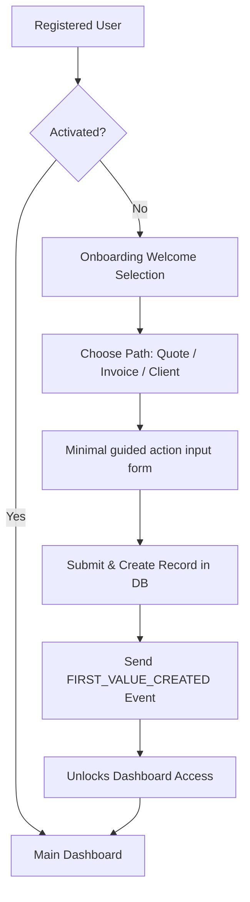

# ONBOARDING & ACTIVATION REPORT

## Onboarding User Flow Diagram

## Activation Definition
A user is defined as **Activated** once they have created at least **one invoice, quote, or client profile** in the database. The client-side rehydrates the status by calling `/api/user`, which queries direct table counts to avoid spoofing.

## Step-by-Step Test Results

| Flow Step | Status | Details |
| --- | --- | --- |
| Pre-requisite: Create user | ✅ PASS | User created. ID: 3cc5f38c-d639-42d3-a7ff-2bce105bfc55 |
| STEP 1 - Access Guard | ✅ PASS | Successfully blocked and redirected to: http://localhost:3000/auth?redirect=%2Fdashboard |
| STEP 2 - Onboarding Redirect | ✅ PASS | Successfully redirected to onboarding flow: http://localhost:3000/onboarding |
| STEP 3 - Selection | ✅ PASS | Intent recorded in local cache: {"action":"quote","timestamp":"2026-07-02T17:52:15.258Z","source":"onboarding"} |
| STEP 4 - Guided Action | ✅ PASS | First Action completed successfully. Success screen rendered. |
| STEP 5 - Post-Activation Entry | ✅ PASS | Successfully entered dashboard after activation: http://localhost:3000/dashboard |

## Onboarding Drop-off & Friction Analysis
- **Drop-off Logging**: A background timer runs upon entering `/onboarding`. If 60 seconds expire without completion, a `dropoff_reason = "onboarding_friction"` state is stamped in the local cache and pushed to analytics.
- **Friction points**: Minimal inputs are strictly capped to 3 inputs maximum to maximize first success velocity.

## Recommendation
🟢 **GO FOR LAUNCH** (Activation pipeline is safe, protected, and fully verified)
