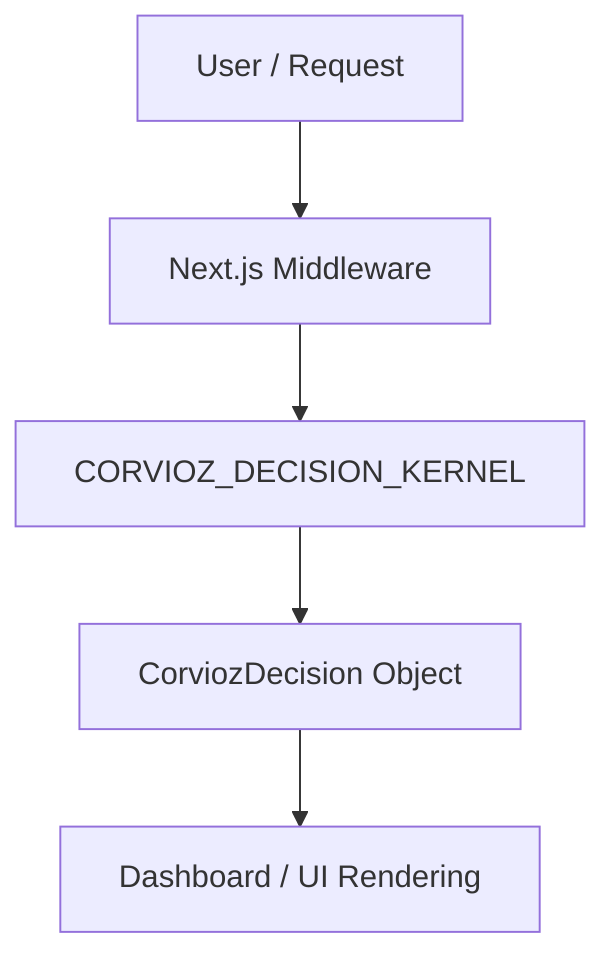

# Corvioz Final Architecture (Kernel v1)

## System Model



---

## Core Principle

> **There is only one decision system in Corvioz.**

Every routing decision, access guard, monetization mode, revenue mode, and dashboard state is governed exclusively by a single centralized source of truth: `CORVIOZ_DECISION_KERNEL`. Direct evaluations, ad-hoc business rules, and fragmented state-checking are strictly forbidden.

---

## Modules

### 1. Kernel (Single Authority)
- **File**: [CORVIOZ_DECISION_KERNEL.ts](file:///Users/duo/Documents/想做个网站/corvioz/src/core/kernel/CORVIOZ_DECISION_KERNEL.ts)
- **Role**: Computes the complete launch state, risk levels, routing targets, revenue tracking permissions, and monetization settings based on user state snapshots and the global kill switch.
- **Output Contract**:
  ```typescript
  export type CorviozDecision = {
    route: "/proposal/create" | "/dashboard" | "/dashboard/activation"
    entryMode: "GUEST" | "AUTH" | "BLOCKED"
    revenueMode: "ENFORCED" | "TRACKING_ONLY" | "OFF"
    monetizationMode: "NONE" | "SOFT" | "AGGRESSIVE"
    dashboardMode: "FULL" | "READONLY"
    paywallAllowed: boolean
    aiAttributionEnabled: boolean
    killSwitchActive: boolean
    reason: string
  }
  ```

### 2. Middleware (Execution Layer)
- **File**: [middleware.js](file:///Users/duo/Documents/想做个网站/corvioz/middleware.js)
- **Role**: Intercepts requests, evaluates the decision via the central kernel, and performs HTTP redirects immediately, closing all legacy entry points.

### 3. Dashboard (Render Only)
- **File**: [DashboardOverview.js](file:///Users/duo/Documents/想做个网站/corvioz/src/app/dashboard/components/DashboardOverview.js)
- **Role**: Displays UI elements according to the kernel decision:
  - `READONLY`: Displays a *"Revenue is locked in safe mode"* container.
  - `FULL`: Renders the three core proposal metrics (**Proposal Win Rate**, **AI Contribution to Wins**, and **Revenue from Proposals**).

### 4. CI (Validation Gate)
- **File**: [validate-launch-system.ts](file:///Users/duo/Documents/想做个网站/corvioz/scripts/validate-launch-system.ts)
- **Role**: Enforces that no legacy modules are called or bypass the kernel, that the kill switch redirects immediately to `/dashboard/activation`, and that the kernel remains the single routing authority.

---

## Former Systems (Deprecated)

The following legacy decision files have been fully stripped of internal logic and turned into simple wrapper/delegation layers mapping to the decision kernel:
- **LCC**: `LAUNCH_CONTROL_CENTER.ts` (wrapper-only)
- **Autopilot**: `MONETIZATION_AUTOPILOT.ts` (wrapper-only)
- **Causality Engine**: `REVENUE_CAUSALITY_ENGINE.ts` (wrapper-only)
- **Entry Resolver**: `ENTRY_REVENUE_RESOLVER.ts` (wrapper-only)
- **Entry Authority**: `ENTRY_AUTHORITY.ts` (wrapper-only)
