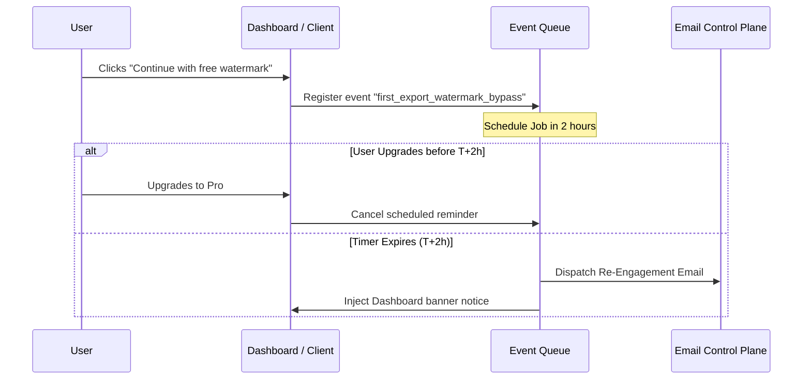

# Corvioz T+2h Revenue Re-Engagement Trigger

This document outlines the design and logic for the scheduled T+2h re-engagement trigger, target users, copy framing, and telemetry details.

---

## ⏰ Trigger Mechanics & Conditions

The T+2h trigger targets low-intent or cautious users who chose the free watermarked preview download over upgrading.

| Specification | Value / Rule |
| :--- | :--- |
| **Trigger Timestamp** | First export timestamp + 120 minutes (T+2h) |
| **Target Cohort** | Free tier users who exported a document but did not upgrade during checkout |
| **Delivery Channel** | Scheduled transactional email (via Resend helper) and/or prominent Dashboard Alert Banner |
| **Exclusion Gate** | If the user upgrades to Pro/Studio *before* T+2h, the scheduled job is automatically canceled |



---

## ✉️ Messaging Design: The "Professional Upgrade Gap"

The re-engagement message addresses the gap between drafting and professional delivery. Rather than focusing on a technical "watermark removal", it frames the upgrade as a necessary step for high-integrity client communications.

### Email Subject Line Options
1. `Is your invoice ready for client delivery?`
2. `Polishing your client delivery on Corvioz`

### Email Message Body Template
```markdown
Hi [Name],

Two hours ago, you prepared your first invoice draft on Corvioz. 

If you've already sent the watermarked PDF preview to your client, they may notice the standard branding. If you want to present a polished, client-ready brand, we recommend upgrading to Pro.

Unlock Professional Invoice Delivery:
* Export clean, professional invoices and quotes instantly.
* Receive client approvals and payments directly through your client portal.
* Position your solo business as a premium service.

Upgrade to Pro now to deliver client-ready documents:
👉 [Upgrade to Pro — $7/mo](https://corvioz.com/pricing?checkout=pro&source=reengagement_email_2h)

Happy freelancing,
Duo, Founder of Corvioz
```

---

## 📊 Telemetry and Conversion Attribution

We track re-engagement efficiency using specific metadata tags:

```json
{
  "event_name": "reengagement_prompt_fired",
  "metadata": {
    "cohort": "revenue_time_compression_v1",
    "delivery_channel": "email",
    "hours_since_export": 2,
    "user_intent_score_at_fire": 68
  }
}
```

* **Attribution**: Conversions occurring within 12 hours of the email click are tagged with `trigger: t_plus_2h_reengagement_trigger` and map directly to the **Fast Path** of our `revenue_compression_model_v1.json` model.
