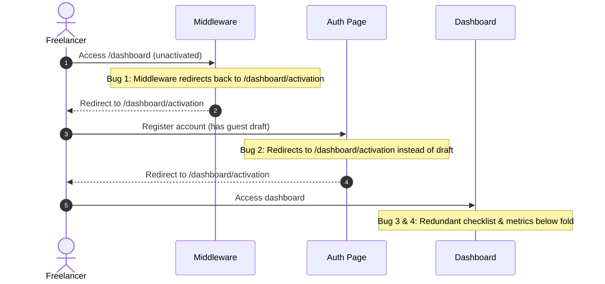

# Corvioz Next-Generation Dashboard: Product Blueprint & UX Research
**Document Version:** 1.0  
**Author:** Head of Product & Senior SaaS UX Architect  
**Sprint Identifier:** Dashboard UX Sprint 1  
**Status:** Ready for Implementation Specification  

---

## 🎯 Executive Philosophy & The Core North Star

Success is **NOT** measured by visual creativity, decorative redesigns, or micro-animations that do not improve business outcomes. 

Success is measured by two deterministic metrics:
1. **3-Second Comprehension:** Can a first-time freelancer immediately understand what the product does and what their next best action is within 3 seconds of landing on their dashboard?
2. **30-Second Completion:** Can they complete a meaningful, value-delivering action (e.g., creating and exporting their first professional invoice or sharing their profile) in less than 30 seconds?

Every pattern, architecture choice, and recommendation in this blueprint is designed to optimize **activation, retention, or conversion**. Any change that does not directly impact these three levers is secondary.

---

## Phase 1 — Dashboard Research: Modern SaaS Benchmarking

To build a best-in-class workspace, we analyze modern SaaS leaders across three priority tiers, focusing on how they solve user activation, clarity, and workflow efficiency.

```
                  ┌────────────────────────────────────────┐
                  │          BENCHMARKING TIERS            │
                  ├────────────────────────────────────────┤
                  │ Tier 1: Bonsai, HoneyBook, Contra      │
                  │ Tier 2: Linear, Notion, Attio          │
                  │ Tier 3: Stripe, Ramp                   │
                  └────────────────────────────────────────┘
```

### 1. Dashboard Hierarchy
* **Bonsai & HoneyBook (Tier 1):** Place a structured, sequential lifecycle at the top (e.g., Proposal → Contract → Invoice → Payment). The dashboard is designed around the *transaction status*, making outstanding money the primary focal point.
* **Linear (Tier 2):** Uses a highly structured task hierarchy. Personal tasks ("My Issues") sit at the absolute top, followed by team boards and team roadmaps.
* **Stripe (Tier 3):** The hierarchy is strictly analytical. It begins with the macroscopic trend (Revenue Graph) and allows immediate drill-down into specific successful or failed transactions.
* **Corvioz Translation:** The dashboard hierarchy must lead with **business health metrics** (Outstanding/Paid), immediately followed by the **Next Best Action** (e.g. "Draft Client Proposal" or "Send Reminder"), and push static documentation or checklist widgets lower.

### 2. First Login Experience (Cold Start Prevention)
* **HoneyBook (Tier 1):** Prevents the empty-state "cold start" by asking 3 simple onboarding questions (industry, average project size, current tools) and pre-populating a mock "active project" based on their response.
* **Notion (Tier 2):** Immediately opens a "Getting Started" interactive page with checkboxes. It does not drop the user onto a blank canvas; it starts them inside an active document.
* **Stripe (Tier 3):** Focuses the first login experience entirely on a checklist to "Activate Account" (KYC, Bank linking). The dashboard remains in "test mode" with toggleable mock data so users can visualize success before inputting real business info.
* **Corvioz Translation:** First login must immediately present an action-oriented choice that directly leads to the first "Aha!" moment (value creation), avoiding generic setup forms.

### 3. Empty States
* **Contra (Tier 1):** Empty states are not dead ends; they are "templates shops." An empty service list displays beautifully designed, clickable starter services (e.g., "Web Design Package") that create the item instantly.
* **Notion (Tier 2):** Empty pages display a list of template shortcuts (Meeting Notes, Kanban Board) that build the page layout with one click.
* **Stripe (Tier 3):** Empty tables show a schematic diagram of how the data flows into that section, with a prominent button to "Create [Item]" and a link to the corresponding developer documentation.
* **Corvioz Translation:** Every empty state must explain **why it exists**, **how it accelerates earnings**, and provide a **single-click creation template**.

### 4. Quick Actions
* **HoneyBook (Tier 1):** Clusters quick actions in a top-right dropdown ("New Project", "Send Invoice", "Create Proposal") that is persistent across all main screens.
* **Linear (Tier 2):** Eliminates visual clutter by routing all quick actions through a global search command bar (`Cmd + K` or `C` to create an issue).
* **Ramp (Tier 3):** Places two massive, high-contrast buttons at the top left: "Request Spend" and "Issue Card." The user never has to search for core operations.
* **Corvioz Translation:** Quick actions must be highly contextual. If an invoice is overdue, the primary quick action on the dashboard should dynamically change to "Send Reminder."

### 5. Information Hierarchy
* **Bonsai (Tier 1):** Highlights a three-column split: Left = Projects/Workspaces, Center = Action Feed & Outstanding Invoices, Right = Time Tracking widget & Quick Links.
* **Stripe (Tier 3):** Divides information by time range. Gross volume, successful payments, and customer growth are shown as absolute values alongside percentage changes compared to the prior period.
* **Corvioz Translation:** Prioritize high-signal financial metrics (receivables, income) at the top, active pipeline/leads in the middle, and historical activity feeds at the bottom.

### 6. Sidebar Structure
* **Attio (Tier 2):** Sidebar is divided into "Core" (Inbox, Tasks), "CRM Lists" (Deals, Candidates), and "Settings." It dynamically collapses to maximize workspace area.
* **Linear (Tier 2):** Uses a clean, nested structure where workspaces can be toggled instantly from the top of the sidebar, keeping settings and profiles tucked away.
* **Corvioz Translation:** Keep the sidebar strictly focused on the operational tools of the user's current tier (Starter, Pro, Studio) to avoid cognitive overload.

### 7. Navigation Rhythm
* **Contra (Tier 1):** Uses an asynchronous, tab-based layout inside a single page structure, which keeps the user's workspace context intact without full browser reloads.
* **Linear (Tier 2):** Utilizes keyboard shortcuts and instant route transitions, giving the application a fast, responsive rhythm.
* **Corvioz Translation:** Use tab-based navigation for operational modules within the dashboard to maintain state, but use clear URL parameters so pages can be deep-linked.

### 8. Business Overview
* **Bonsai (Tier 1):** Displays a "Cash Flow" line chart showing income vs. expenses over the last 30 days, giving freelancers an instant visual of their profitability.
* **Stripe (Tier 3):** Renders a highly responsive area chart of sales volume, which updates in real-time as payments are processed.
* **Corvioz Translation:** A simple bar chart or sparkline showing monthly revenue and pending payouts is sufficient to establish a professional workspace.

### 9. Recent Activity
* **Attio (Tier 2):** Shows a chronological stream of client interactions ("Client opened email", "Status changed to Proposal").
* **Ramp (Tier 3):** Uses a simple, clean transaction table showing card spend with instant receipt-attachment buttons.
* **Corvioz Translation:** Recent activity should be transactional: "Client viewed proposal", "Invoice #1002 paid", "New lead captured."

### 10. Upgrade UX (Monetization Gates)
* **Bonsai (Tier 1):** Employs "soft gates." Users can draft unlimited contracts, but attempting to sign or send them triggers the upgrade modal. This allows users to experience the builder's value before hitting a wall.
* **Notion (Tier 2):** Uses feature-limit gates. When a user runs out of free blocks or tries to upload a file > 5MB, a non-intrusive banner appears highlighting the upgrade path.
* **Contra (Tier 1):** Monetizes premium features (e.g., custom domains, commission-free payments) rather than basic client communication, framing the upgrade as a business expansion tool.
* **Corvioz Translation:** Use a soft-gate structure (e.g., 1st export free with watermark, 2nd export triggers Pro upgrade) to build user dependency and trust before requesting payment.

---

## Phase 2 — Dashboard Pattern Library

A collection of standard, optimized dashboard components designed to drive user activation, reduce cognitive load, and increase conversion rates.

```
┌────────────────────────────────────────────────────────────────────────┐
│                        DASHBOARD PATTERN LIBRARY                       │
├────────────────────────────────────────────────────────────────────────┤
│ 1. Hero Patterns        2. Quick Actions         3. Status Cards       │
│ 4. Workspace Panels     5. Insight Modules       6. Timeline Feeds     │
└────────────────────────────────────────────────────────────────────────┘
```

### 1. Hero Patterns
The hero pattern sets the tone for the entire workspace. It must adapt to the user's status to drive the immediate next action.

* **Pattern A: The Guided Onboarding Greeting (New/Unactivated Users)**
  * *UI Layout:* Left-aligned large heading, progress bar on the right.
  * *Copy:* "Good morning, [Name]. Let's secure your first client payment."
  * *Subtext:* "Complete these 2 setup steps to launch your workspace."
  * *Visual Cue:* 50% Progress bar indicating "Invoice Drafted" (Checked) and "Send to Client" (Pending).
  * *Goal:* Clear direction, removing first-time user hesitation.
* **Pattern B: The Operational Focus Header (Active Users with Pending Actions)**
  * *UI Layout:* Centered headline with a highlighted alert box below.
  * *Copy:* "Welcome back, [Name]. Today's priority:"
  * *Alert Box:* "Invoice #1042 for Acme Corp is overdue by 3 days. Send a payment reminder in one click." (Primary CTA button: "Send Reminder").
  * *Goal:* Maximize cash flow velocity for the freelancer, building high retention value.
* **Pattern C: The Quiet Business Summary (Healthy/Active Accounts)**
  * *UI Layout:* A clean, typography-focused greeting with a small sparkline showing 30-day revenue trends.
  * *Copy:* "You've earned $4,200 this month. $1,200 is outstanding."
  * *Goal:* Simple validation of business success without cluttering the screen.

### 2. Quick Action Patterns
Quick actions must reside in an easily accessible horizontal layout, allowing core tasks to be launched with a single click.

* **Create Invoice:** Launches the split-screen invoice builder. If a draft exists, it opens with a prompt: "Continue editing draft invoice #1003?"
* **Create Quote:** Launches the proposal builder. If the user has a CRM lead, it prompts: "Generate quote for lead: [Client Name]?"
* **Add Client:** Opens a minimal overlay modal with fields: Company Name, Client Email, Currency. Auto-saves to client database.
* **Continue Draft:** Dynamically visible when a draft is detected. Displays: "Draft Invoice #1003 ($450) - 80% Complete" with a "Resume" button.
* **Send Reminder:** Appears dynamically when an invoice is overdue. Instantly sends a pre-formatted, polite email reminder via the communication layer.
* **Share Profile:** Copies the user's public Bento card link to their clipboard and displays a toast: "Bento Profile Link copied! Share with clients to capture leads."

### 3. Status Card Patterns
Status cards provide an instant snapshot of business performance. Each card contains a label, a primary value, a trend indicator, and a secondary action.

* **Revenue Card:**
  * *Label:* Revenue (Billed)
  * *Value:* `$12,450` (or local currency symbol)
  * *Trend:* `+18% vs last month` (green text)
  * *Context:* Cumulative paid invoices within the active billing cycle.
* **Outstanding Card:**
  * *Label:* Receivables / Outstanding
  * *Value:* `$3,200`
  * *Trend:* `3 invoices pending`
  * *Action:* Clickable to display a filtered list of unpaid invoices.
* **Clients Card:**
  * *Label:* Active Clients
  * *Value:* `8`
  * *Trend:* `+2 new this month`
  * *Context:* Helps freelancers track customer growth.
* **Quotes Card:**
  * *Label:* Pending Proposals
  * *Value:* `4`
  * *Trend:* `$6,800 projected value`
  * *Context:* Represents potential near-term revenue.
* **Payments Card:**
  * *Label:* Settlement Time
  * *Value:* `2.4 Days` (Average)
  * *Trend:* `-0.5 days since last month`
  * *Context:* Measures payment speed from the time the client opens the portal.
* **Conversion Card:**
  * *Label:* Win Rate
  * *Value:* `72%`
  * *Trend:* `Quotes converted to paid invoices`
  * *Context:* Measures proposal-to-payment efficiency.
* **Business Health Card:**
  * *Label:* Financial Runway
  * *Value:* `4.2 Months`
  * *Trend:* `Based on average monthly expenses`
  * *Context:* Provides peace of mind and long-term security.

### 4. Workspace Patterns
Workspace panels are dedicated zones where active data is displayed. They organize the freelancer's daily workflow.

* **Today’s Focus:** A single, high-contrast widget positioned at the top center of the dashboard workspace. It displays the one task that will have the greatest impact on cash flow (e.g., "Follow up on approved proposal for Zenith Labs").
* **Upcoming Tasks:** A simple checklist sorted by due date:
  * "Invoice #1052 due in 2 days"
  * "Project milestone review tomorrow"
* **Drafts Workspace:** A list of incomplete items. If a user starts an invoice but leaves, the draft is displayed here with an explicit "Resume Draft" button, preventing lost progress.
* **Pipeline Board:** A horizontal Kanban-style pipeline for leads:
  * `Inquiry (1)` → `Proposal Sent (2)` → `Approved (1)` → `Paid (4)`
* **Client Activity Feed:** Live notification panel:
  * "Acme Corp opened Invoice #1002" (2 mins ago)
  * "Zenith Labs accepted Quote #204" (1 hour ago)

### 5. Insight Patterns
Insight cards are generated by the system (AI or heuristics) to help freelancers run their businesses more effectively.

* **AI Suggestions:** Analyzes a CRM lead description and suggests a pricing structure: "Based on the client's description, we recommend a tiered proposal: $1,200 basic / $2,000 professional."
* **Business Health Alerts:** Warns the user of potential issues: "You have 3 invoices overdue. Total unpaid balance is $2,400, which is higher than your average monthly revenue."
* **Revenue Forecast:** A predictive chart showing expected cash inflows based on invoice due dates and historical client payment speeds.
* **Operational Recommendations:** Heuristics-driven suggestions: "Freelancers who connect a Stripe payment gateway get paid 4x faster. Connect your gateway today."

### 6. Timeline Patterns
Timelines track a document's journey from creation to settlement. This eliminates client communication anxiety.

* **Recent Activity Feed:** A simple vertical timeline showing the latest actions across the entire workspace.
* **Client Actions Timeline:** Specific to a single document:
  * `Created` (June 24, 09:00)
  * `Sent` (June 24, 09:15)
  * `Opened by Client` (June 24, 14:32)
  * `Payment Attempted` (June 25, 10:00)
  * `Paid & Settled` (June 25, 10:02)

---

## Phase 3 — Empty State Library

Empty states are the most common source of early-stage user attrition. This library converts blank screens into educational and action-oriented conversion opportunities.

```
┌────────────────────────────────────────────────────────────────────────┐
│                           EMPTY STATE LIBRARY                          │
├────────────────────────────────────────────────────────────────────────┤
│  A framework designed to turn cold, empty screens into high-activation │
│  onboarding surfaces.                                                  │
└────────────────────────────────────────────────────────────────────────┘
```

```
┌────────────────────────────────────────────────────────────────────────┐
│                    THE GOAL-ACTION-SAFETY FRAMEWORK                    │
├────────────────────────────────────────────────────────────────────────┤
│ 1. The Goal: Why does this section exist? What is the outcome?        │
│ 2. The Action: A single, clear, low-friction button or template.       │
│ 3. The Safety: Social proof, time estimates, or safety guarantees.      │
└────────────────────────────────────────────────────────────────────────┘
```

---

### 1. Dashboard Empty State
* **Why it works:** Explains that the dashboard is a control center for revenue. It provides an immediate preview of what the metrics will look like once data starts flowing.
* **Why it improves activation:** It removes the fear of a blank screen by rendering a faint, blurred mockup of active metric charts behind the onboarding checklist, building anticipation.
* **How Corvioz could improve it:** Replace the current text-heavy layout with a highly visual "interactive walk-through" that lets users click on mock metrics to see how they are calculated.

### 2. Invoices Empty State
* **Why it works:** Focuses entirely on the ultimate outcome: getting paid.
* **Why it improves activation:** It includes a prominent button saying "Create Invoice (Takes 60 seconds)" and displays a thumbnail of a beautifully formatted invoice.
* **How Corvioz could improve it:** Offer three quick-start templates (e.g., "Retainer Invoice", "Project Milestone", "Hourly Bill") so the user doesn't have to design the structure from scratch.

### 3. Quotes Empty State
* **Why it works:** Frames quotes as a tool to lock in projects and prevent scope creep.
* **Why it improves activation:** Explains that a client can accept a proposal in a single click, instantly converting it to an invoice.
* **How Corvioz could improve it:** Pre-populate a sample quote (e.g., "UI Design Package") that users can view and copy in one click, immediately discovering the conversion mechanic.

### 4. Clients Empty State
* **Why it works:** Explains the benefit of saving client data: zero manual retyping.
* **Why it improves activation:** Shows how invoice creation speeds up once client profiles are saved.
* **How Corvioz could improve it:** Add a simple "Import from CSV" or "Sync from Google Contacts" option to reduce manual data-entry friction.

### 5. Public Profile Empty State
* **Why it works:** Connects the profile to inbound lead acquisition.
* **Why it improves activation:** Explains that this is their "public shopfront" where clients can submit inquiries directly to their CRM.
* **How Corvioz could improve it:** Provide a "1-Click Generate Profile" using AI or prefilled registration data, so they instantly have a working URL.

### 6. Client Portal Empty State
* **Why it works:** Shows the client-facing experience, building confidence in the freelancer's brand.
* **Why it improves activation:** Renders a mock view of what a client sees when they receive an invoice (Stripe gateway, messaging area, PDF download).
* **How Corvioz could improve it:** Add a button: "View Demo Client Portal" so the user can experience the customer flow from the client's perspective.

### 7. Analytics Empty State
* **Why it works:** Focuses on business insights and cash-flow health.
* **Why it improves activation:** Shows mock data of revenue trends, average payment speeds, and tax projections to demonstrate the value of tracking finances.
* **How Corvioz could improve it:** Show a simple prompt: "Create and send 1 invoice to start charting your monthly revenue."

### 8. AI Empty State
* **Why it works:** Positions AI as a personal business assistant.
* **Why it improves activation:** Lists specific prompts the AI can solve (e.g., "Draft a proposal for a $5,000 rebranding project").
* **How Corvioz could improve it:** Display a running feed of sample inputs and outputs so the user immediately understands how to write prompts that get good results.

---

## Phase 4 — Dashboard Growth System

The Dashboard Growth System maps features and information priority across three progressive tiers. Each tier functions as a complete, tailored operational surface, with contextual triggers designed to transition the user to the next stage as their business scales.

```
                  ┌────────────────────────────────────────┐
                  │        PROGRESSIVE GROWTH SYSTEM       │
                  ├────────────────────────────────────────┤
                  │ Starter    →   Professional  →  Studio │
                  │ ($9/mo)    │     ($19/mo)    │ ($29/mo)│
                  └────────────┴─────────────────┴─────────┘
```

---

### 1. Starter Tier ($9/mo) — "First Client Closure Engine"
* **Goal:** Help early-stage freelancers land their first client, issue their first invoice, and secure their first payout.
* **Core Modules:**
  * Basic Invoice Generator (pre-filled fields).
  * Single-format PDF Export.
  * Basic Invoice List (Draft, Sent, Paid status).
* **Optional Modules:**
  * Public Bento Card Profile (basic service listing, no custom domain).
  * Direct Stripe payment integration.
* **Information Priority:**
  * **Priority 1:** Primary Quick Action: "Create Invoice."
  * **Priority 2:** Receivables indicator: "Unpaid Invoices ($ Total)."
  * **Priority 3:** Verification banner: "Secure payments via Stripe."
* **Contextual Upgrade Opportunities (Transition to Pro):**
  * *Trigger 1 (Behavioral):* The user attempts to export their **2nd PDF invoice**.
  * *Trigger 2 (Volume):* The user creates their **2nd client profile**.
  * *Frictionless Pitch:* "Upgrade to Professional to remove the Corvioz watermark from your invoices and proposals." (No pricing page redirection; inline checkout modal).

---

### 2. Professional Tier ($19/mo) — "Income Engine"
* **Goal:** Increase workflow productivity, automate client invoicing, and scale pipeline velocity.
* **Core Modules:**
  * **Proposals & Quotes:** Split-screen proposal builder with one-click conversion to invoices.
  * **Leads CRM Inbox:** Capture client inquiries directly from their public profile.
  * **Client Directory:** Database of contacts, custom rates, and payment terms.
  * **Watermark-Free Exports:** Clean, white-labeled PDFs.
* **Optional Modules:**
  * Basic Business Reports (monthly income chart, outstanding receivables).
* **Information Priority:**
  * **Priority 1:** CRM Inbox: "New client inquiries."
  * **Priority 2:** Active Pipeline: "Total value of open proposals."
  * **Priority 3:** Core Metrics: Revenue vs. Outstanding balance.
* **Contextual Upgrade Opportunities (Transition to Studio):**
  * *Trigger 1 (Scale):* User reaches **3 active clients** in their database.
  * *Trigger 2 (Overdue Friction):* An invoice remains **7 days overdue**, and the user clicks to send a manual reminder.
  * *Frictionless Pitch:* "Unlock Studio OS to enable automated payment reminders, custom branding portals, and advanced reports."

---

### 3. Studio Tier ($29/mo) — "Client Growth Pack / Studio OS"
* **Goal:** Automate business administrative work and scale client operations under a premium, white-labeled brand.
* **Core Modules:**
  * **Studio Space:** Workspace for managing multi-client projects and overdue receivables.
  * **White-labeled Portals:** Dedicated client portal hosted on a custom domain.
  * **Automation Engine:** Automated payment reminders, Slack notifications, and webhook integrations.
  * **Studio Reports:** Pipeline velocity, client acquisition costs, and tax projections.
  * **Showcase Manager:** Case studies, results tracking, and media showcases.
* **Information Priority:**
  * **Priority 1:** Client Portals: "Active client interactions (Views, Comments)."
  * **Priority 2:** Automation Center: "Reminders sent, scheduled payouts."
  * **Priority 3:** Reports: Annual revenue forecast, tax reserve projections.
* **Upgrade Opportunities:**
  * Annual upgrade offers ($24/mo billed annually) displaying total savings ($60/year).
  * Agency collaborator seats (add team members for $10/user/month).

---

## Phase 5 — Dashboard Information Architecture

The Information Architecture maps the display hierarchy, structural relationships, and user journey flows across the workspace to guarantee a 3-second comprehension window.

### 1. The Module Map & Display Order
To prevent cognitive overload, the layout is organized into structured zones. Information flows from high-level summaries at the top to granular action lists at the bottom.

```
┌────────────────────────────────────────────────────────────────────────┐
│                        DASHBOARD LAYOUT SCHEMATIC                      │
├────────────────────────────────────────────────────────────────────────┤
│ ZONE 1: Contextual Hero Banner (Greeting, Today's Focus)               │
├────────────────────────────────────────────────────────────────────────┤
│ ZONE 2: Core Financial metrics (Paid, Outstanding, Open Pipeline)      │
├────────────────────────────────────────────────────────────────────────┤
│ ZONE 3: Action Center (Horizontal Quick Action buttons)                │
├────────────────────────────────────────────────────────────────────────┤
│ ZONE 4: Active Workspaces (CRM Leads, Invoices List, Active Quotes)    │
├────────────────────────────────────────────────────────────────────────┤
│ ZONE 5: Activity Feed (Timeline events, audit trail)                   │
└────────────────────────────────────────────────────────────────────────┘
```

---

### 2. Information Relationships & Entities
Data flows logically between business objects. This flow mirrors the real-world client lifecycle.

```
  ┌─────────────┐        converts to        ┌─────────────┐
  │  CRM Lead   │ ────────────────────────> │   Proposal  │
  └─────────────┘                           └─────────────┘
                                                   │
                                                   │ converts to
                                                   ▼
  ┌─────────────┐         settles into      ┌─────────────┐
  │   Revenue   │ <──────────────────────── │   Invoice   │
  └─────────────┘                           └─────────────┘
```

* **Lead (CRM):** Captures incoming inquiries. Attributes: Client name, project summary, estimated budget, status (Inquiry, Qualified, Closed).
* **Quote (Proposal):** Outlines project scope. Attributes: Milestone terms, pricing packages, acceptance status (Draft, Sent, Approved, Expired).
* **Invoice (Billing):** Records the financial transaction. Attributes: Due date, line items, taxes, status (Draft, Sent, Paid, Overdue).
* **Revenue (Analytics):** Tracks cash inflows. Attributes: Settled payouts, outstanding balances, average collection period.

---

### 3. User Flows & Navigation Pathways

* **The Activation Path (First-Time User):**
  * `Registration` → `Dashboard Activation Screen` (Choose "Create Invoice") → `Invoice Builder` → `PDF Export` (1st free download with watermark) → `Dashboard` (check Onboarding Checklist) → `Publish Bento Profile`.
* **The Returning Operational Path (Pro/Studio User):**
  * `Dashboard` → `Read Today's Focus` → `Select Unpaid Invoice` → `Click Send Reminder` → `View Client Activity Feed`.
* **The Conversion Path (Paying User Lifecycle):**
  * `Create 2nd Invoice` → `Click Download PDF` → `Evaluate Action (evaluateAction('export_pdf'))` → `PricingUpsellModal Opens` → `Click Upgrade` → `Paddle Checkout` → `Watermark Removed`.

---

## Phase 6 — Product UX Audit

An inspection of the active Corvioz codebase has revealed critical bottlenecks, system redundancies, and routing issues that directly impact user activation and conversion rates.

```
┌────────────────────────────────────────────────────────────────────────┐
│                         PRODUCT UX AUDIT MATRIX                        │
├────────────────────────────────────────────────────────────────────────┤
│ Issue                                             │ Severity           │
├───────────────────────────────────────────────────┼────────────────────┤
│ 1. Broken Skip Navigation (Redirection Loop)      │ CRITICAL 🔴        │
│ 2. Broken Guest-to-Paid Restoration Flow          │ CRITICAL 🔴        │
│ 3. Redundant Onboarding Loops                     │ HIGH 🟠            │
│ 4. Inverted Information Hierarchy                 │ HIGH 🟠            │
│ 5. Passive and Non-Actionable Empty States        │ MEDIUM 🟡          │
│ 6. Missing Proactive Business Guidance            │ MEDIUM 🟡          │
│ 7. Static Banners Instead of Contextual Paywalls  │ MEDIUM 🟡          │
└───────────────────────────────────────────────────┴────────────────────┘
```

---

### 1. Broken Skip Navigation (Redirection Loop)
* **Description:** On the Activation page (`src/app/dashboard/activation/page.tsx`), a prominent button allows users to "Skip to full workspace" by navigating to `/dashboard`. However, the server-side middleware (`middleware.js`) evaluates the user's status via `ENTRY_AUTHORITY`. If the user is unactivated (`hasActivated` is false), the middleware automatically redirects them back to `/dashboard/activation`.
* **Cognitive Impact:** The user clicks the skip link, the page reloads, and they are returned to the exact same screen they tried to skip. The user is trapped in a loop and will assume the application is broken or buggy.
* **Severity:** **CRITICAL 🔴**
* **Recommendation:** Update the server-side routing layer or the skip button logic to assign a temporary override token (or local session state) that allows unactivated users to explore `/dashboard` in a read-only or restricted state without being blocked.

---

### 2. Broken Guest-to-Paid Restoration Flow
* **Description:** Corvioz allows anonymous users to draft invoices in Guest Mode. When they choose to sign up to save their progress, they navigate to `/auth` and complete registration. However, after signing up, the system evaluates their account state. Because they are a new user, they have not yet met the server-sider `hasActivated` criteria. Consequently, they are automatically redirected to `/dashboard/activation` ("What would you like to do first?").
* **Cognitive Impact:** The draft invoice they created in Guest Mode is lost or hidden, and they are forced to complete a checklist instead of continuing their work. This breaks the continuation promise made on the signup page.
* **Severity:** **CRITICAL 🔴**
* **Recommendation:** Prioritize draft restoration in the entry flow. If `localStorage` contains a guest draft, the onboarding flow should bypass `/dashboard/activation` and drop the user directly into the restored draft editor.

---

### 3. Redundant Onboarding Loops
* **Description:** The onboarding experience is duplicated. The user is forced to `/dashboard/activation` where they must choose between: Create Invoice, Send Quote, or Add Client. Once they complete one of these steps and land on `/dashboard`, they are presented with a second "Get Started Checklist" (`DashboardOverview.js`) asking them to perform the exact same tasks.
* **Cognitive Impact:** It feels like repetitive homework. The user has already created an invoice, but the app is still telling them to "Generate a Professional Invoice."
* **Severity:** **HIGH 🟠**
* **Recommendation:** Consolidate onboarding into a single, unified checklist. If the user completes the invoice creation step during the activation page, mark that item as complete on the dashboard checklist.

---

### 4. Inverted Information Hierarchy (Starter Overview Page)
* **Description:** On the Starter Dashboard, the layout prioritizes onboarding and documentation over core metrics. The top of the screen displays the "Get Started Checklist" and a "Why Corvioz is safe" card. The user's actual metrics ("Revenue today" and "Unpaid Invoices") are pushed to the absolute bottom of the screen.
* **Cognitive Impact:** The dashboard looks like a promotional landing page rather than a utility workspace. The user's focus is directed toward platform safety instead of their business health.
* **Severity:** **HIGH 🟠**
* **Recommendation:** Move the metrics cards ("Revenue", "Outstanding") to the top of the workspace. Shift the checklist and promotional guides to a right-hand sidebar or below the fold.

---

### 5. Passive and Non-Actionable Empty States
* **Description:** Under the Clients, Invoices, and Quotes tabs, the empty states consist of passive text strings (e.g., `"No clients saved. Clients are automatically saved when billing."`). There are no templates, sample cards, or actionable buttons.
* **Cognitive Impact:** When a user clicks a tab and sees a blank page with no instructions, it creates friction. They don't know what step to take next.
* **Severity:** **MEDIUM 🟡**
* **Recommendation:** Rebuild empty states using the Goal-Action-Safety framework. Include mock templates (e.g., "Add Client") and brief descriptions of how the module benefits their business.

---

### 6. Missing Proactive Business Guidance
* **Description:** The dashboard acts as a passive data renderer. If an invoice is overdue, the system does not surface it as an actionable alert. The user has to navigate to the invoices list, find the overdue item, and click to send a reminder.
* **Cognitive Impact:** The user must manually scan their data to find work. The app does not save them administrative time.
* **Severity:** **MEDIUM 🟡**
* **Recommendation:** Introduce a "Today's Focus" widget that dynamically pulls high-priority actions (e.g., "Send reminder for Invoice #1024") and places them at the top of the dashboard.

---

### 7. Static Banners Instead of Contextual Paywalls
* **Description:** The system displays general upgrade banners (e.g., "Upgrade to Pro for more features"). These banners appear regardless of whether the user has experienced the value of the platform.
* **Cognitive Impact:** Banners feel like banner ads. They are easily ignored and do not align with the user's current needs.
* **Severity:** **MEDIUM 🟡**
* **Recommendation:** Link paywalls to "value milestones." For example, when a user completes their first successful PDF download, show a toast explaining the benefits of Pro. Trigger the paywall modal on the 2nd export attempt.

---

## Sprint 2 Action Plan (Implementation Specification)

To resolve the critical issues identified in this audit, the next Dashboard Sprint must focus on the following three implementation tasks:



1. **Fix the Middleware Redirection Loop:**
   * Modify `middleware.js` to allow unactivated users access to a read-only `/dashboard` route if they have selected to "Skip to full workspace."
2. **Implement the Guest-to-Paid Draft Restoration:**
   * Modify the post-signup redirection logic to check for a `draft_invoice` token in `localStorage`. If found, bypass the activation page and redirect the user straight to `/invoices/create?restore=true`.
3. **Re-structure the Starter Dashboard Hierarchy:**
   * Move the metric cards to the top of `DashboardOverview.js`.
   * Move the checklist and safety modules below the metrics or to a collapsible sidebar.
   * Replace passive empty states with actionable templates.
