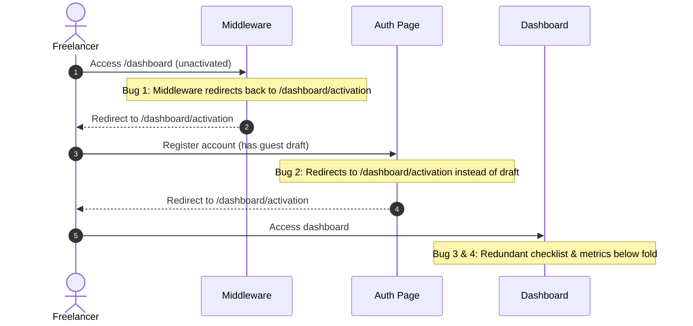

# Corvioz Workspace Experience Architecture: From Dashboard to Daily Business Workspace
**Document Version:** 2.0  
**Author:** Head of Product & Senior SaaS UX Architect  
**Sprint Identifier:** Workspace Experience Sprint 1  
**Status:** Approved for Workspace Refactoring Specification  

---

## Executive Summary

The transition of Corvioz from a traditional SaaS dashboard into a **Freelancer Daily Business Workspace** represents a fundamental shift in product philosophy. A dashboard is passive and diagnostic; it reports what has already happened, often resulting in "data dumping" that causes cognitive fatigue. A workspace is active and operational; it guides the freelancer to their next best action, reducing admin time and accelerating payments.

This architecture document defines the product blueprint to build this operational habit loop. It aligns the visual layout, intelligence engines, and subscription tiers to the actual daily rhythm of a freelancer. By structuring the workspace into five dedicated zones, replacing a static health score with an actionable Business Health System, and re-framing the three paid tiers as distinct business maturity modes, we align the product directly with customer activation, retention, and conversion.

---

## Phase 1 — Reframe Dashboard into Workspace

To transition Corvioz from a reporting tool into a daily work habit, we must re-frame our core UI terminology and product concepts.

```
┌────────────────────────────────────────────────────────────────────────┐
│                        THE PHILOSOPHICAL SHIFT                         │
├────────────────────────────────────────────────────────────────────────┤
│ Traditional Dashboard Thinking        │ Freelancer Workspace Thinking  │
├───────────────────────────────────────┼────────────────────────────────┤
│ • Overview / Landing                  │ • Today's Work                 │
│ • Financial Charts & Metrics          │ • Money Waiting / Receivables  │
│ • Admin Panel                         │ • Clients Needing Attention    │
│ • Feature Lists & Locks               │ • Invoices Needing Action      │
│ • Passive Data Tables                 │ • Next Best Action             │
└───────────────────────────────────────┴────────────────────────────────┘
```

### Why Workspace Thinking Drives Business Outcomes

1. **Improving Activation (First 30 Seconds):**
   * *The Dashboard Problem:* Drops a user onto a blank canvas of empty charts, creating a "cold start" feeling. The user feels overwhelmed and doesn't know where to start.
   * *The Workspace Solution:* Focuses the first screen on a single, high-contrast action card: "Create your first invoice (Takes 60 seconds)." The interface is a guided pathway toward experiencing value.
2. **Increasing Retention (Daily Habit Loop):**
   * *The Dashboard Problem:* Once an invoice is sent, the user has no reason to log back in until they need to create another one (often weeks later).
   * *The Workspace Solution:* Centers the experience around "Money Waiting" and "Client Activity." The user logs in daily to see if their portal link has been opened, if a quote was accepted, or if a reminder needs to be sent in one click.
3. **Accelerating Conversion (Value-Linked Gates):**
   * *The Dashboard Problem:* Shows upgrade banners for locked features, which feel like intrusive advertisements.
   * *The Workspace Solution:* Ties upgrades to operational friction. When a freelancer experiences the friction of manual follow-ups on an overdue invoice or reaches a client database limit, the workspace offers an inline resolution: "Unlock automated reminders with Professional Mode."

---

## Phase 2 — Freelancer Daily Workflow Map

A realistic daily workflow for a North American freelancer, showing how the workspace responds to their needs and anxieties from morning login to evening log-off.

```
  ┌───────────┐      ┌───────────┐      ┌───────────┐      ┌───────────┐
  │ 1. Open   │ ───> │ 2. Focus  │ ───> │ 3. Leads  │ ───> │ 4. Quotes │
  └───────────┘      └───────────┘      └───────────┘      └───────────┘
                                                                 │
  ┌───────────┐      ┌───────────┐      ┌───────────┐      ┌───────────┐
  │ 8. Close  │ <─── │ 7. Health │ <─── │ 6. Remind │ <─── │ 5. Invoice│
  └───────────┘      └───────────┘      └───────────┘      └───────────┘
```

---

### Step 1: Open Corvioz
* **User Intent:** Assess if anything changed overnight (payments, lead submissions).
* **User Anxiety:** "Did my client pay me? Did I miss a project inquiry?"
* **Product Response:** Display a clean greeting with an active alert banner showing new events.
* **Required Module:** Zone 1 Hero Header + Recent Activity Feed.
* **Primary CTA:** "View Client Portal activity."
* **Success Metric:** Time-to-comprehension < 3 seconds.

### Step 2: Review Today's Focus
* **User Intent:** Identify the single most important task for the day.
* **User Anxiety:** "What should I prioritize? What is blocking my cash flow?"
* **Product Response:** Surface a single high-priority action card at the top of the workspace.
* **Required Module:** "Today's Focus" Widget.
* **Primary CTA:** "Send overdue reminder" or "Accept proposal."
* **Success Metric:** 1-click execution of the prioritized task.

### Step 3: Handle Urgent Client Actions
* **User Intent:** Respond to prospective client requests.
* **User Anxiety:** "If I don't reply quickly to this lead, will they hire someone else?"
* **Product Response:** Render a clear CRM Leads Inbox displaying new forms submitted via their Bento Profile.
* **Required Module:** Leads CRM.
* **Primary CTA:** "Draft AI Quote Proposal."
* **Success Metric:** Lead response time under 15 minutes.

### Step 4: Follow Up on Open Quotes
* **User Intent:** Push pending proposals toward approval.
* **User Anxiety:** "Did they read my proposal? Should I follow up now or wait?"
* **Product Response:** Highlight quotes that have been viewed by the client multiple times, indicating high buying intent.
* **Required Module:** Quotes Pipeline.
* **Primary CTA:** "Send Follow-Up Message."
* **Success Metric:** Quote-to-invoice conversion time reduced.

### Step 5: Create and Send Invoices
* **User Intent:** Bill for completed milestones or monthly retainers.
* **User Anxiety:** "I hate billing admin. Let me get this invoice out as fast as possible."
* **Product Response:** Open the split-screen editor, pre-filling client details from the CRM directory.
* **Required Module:** Invoice Creator.
* **Primary CTA:** "Send Invoice via Portal."
* **Success Metric:** Invoice creation and send time < 60 seconds.

### Step 6: Track Overdue Payments
* **User Intent:** Check outstanding balances and prompt payment.
* **User Anxiety:** "I hate chasing money. It feels awkward to ask for payment."
* **Product Response:** Offer a gentle, automated reminder script that can be sent in one click.
* **Required Module:** Overdue Manager.
* **Primary CTA:** "Send Reminder."
* **Success Metric:** Receivables collection period reduced.

### Step 7: Continue Drafts
* **User Intent:** Resume work on incomplete documents.
* **User Anxiety:** "Did my draft save? I don't want to lose my work."
* **Product Response:** Render a local draft preservation card showing where they left off.
* **Required Module:** Drafts List.
* **Primary CTA:** "Resume Draft Invoice #1003."
* **Success Metric:** Draft completion rate increased.

### Step 8: Review Business Health
* **User Intent:** Check financial status and verify runway.
* **User Anxiety:** "Am I earning enough to cover my monthly expenses?"
* **Product Response:** Show cash runway metrics and a simple monthly revenue graph.
* **Required Module:** Business Health Advisor.
* **Primary CTA:** "View Financial Report."
* **Success Metric:** Reduced financial anxiety rating (retention builder).

### Step 9: End the Day with Next Actions
* **User Intent:** Close out work with a clear plan for tomorrow.
* **User Anxiety:** "Did I forget anything? What do I need to do tomorrow morning?"
* **Product Response:** Show a summary of tomorrow's scheduled tasks and client follow-ups.
* **Required Module:** Focus Scheduler.
* **Primary CTA:** "Set Tomorrow's Priority."
* **Success Metric:** 90% return rate the next day.

---

## Phase 3 — Workspace Zones

The workspace is organized into five functional zones, each corresponding to a specific operational objective.

```
┌────────────────────────────────────────────────────────────────────────┐
│                        FIVE WORKSPACE ZONES                            │
├────────────────────────────────────────────────────────────────────────┤
│ Zone 1 — TODAY: Time-sensitive priority tasks.                          │
│ Zone 2 — MONEY: Cash flow tracking and invoice collection.              │
│ Zone 3 — CLIENTS: Relationships, leads, and communication logs.        │
│ Zone 4 — WORK IN PROGRESS: Active drafts and profile setups.           │
│ Zone 5 — BUSINESS HEALTH: Strategic guidance and optimization tips.     │
└────────────────────────────────────────────────────────────────────────┘
```

---

### Zone 1 — Today
* **Purpose:** Direct the user's focus to time-sensitive tasks that require immediate attention.
* **User Question Answered:** "What do I need to do *right now* to keep my projects moving and get paid?"
* **Modules Included:** Today's Focus Card, Urgent Client Alerts, Calendar/Milestone list.
* **Empty State:** "All clear! You are fully caught up for the day." (Provides a checklist of optional optimizations, like updating service packages).
* **Upgrade Opportunity:** Professional users unlock "Automated Follow-up Tasks." Studio users unlock "Team Assignment & Collaborator Tasks."
* **Behavior by Tier:**
  * *Starter:* Manual task checklist based on invoice due dates.
  * *Professional:* Interactive alerts linked to CRM lead status and quote views.
  * *Studio:* Automated workflow reminders and client message center updates.

---

### Zone 2 — Money
* **Purpose:** Monitor invoice statuses, collect payments, and track cash inflows.
* **User Question Answered:** "What is the status of my invoices? How much money is outstanding?"
* **Modules Included:** Paid Revenue (current month), Receivables (Outstanding), Payout schedule, Invoice list.
* **Empty State:** Schematic diagram showing how to link Stripe to accept credit cards.
* **Upgrade Opportunity:** Starter users upgrade to Pro to remove watermarks on their 2nd invoice export. Pro users upgrade to Studio for white-labeled client portals.
* **Behavior by Tier:**
  * *Starter:* Simple table of Sent vs. Paid invoices.
  * *Professional:* Aging receivables report (e.g. 7, 14, 30 days overdue) with manual email reminder CTAs.
  * *Studio:* Automated reminder engine (Net-14 reminders), revenue forecast charts, and tax reserve calculations.

---

### Zone 3 — Clients
* **Purpose:** Capture new project leads and manage active client relationships.
* **User Question Answered:** "Who are my active prospects? Who is waiting on a proposal?"
* **Modules Included:** Leads Inbox, CRM Pipeline, Client Contact Directory.
* **Empty State:** Prompts the user to publish their Bento Profile with a copyable link: *"Ready to capture client inquiries? Share your Bento Profile link."*
* **Upgrade Opportunity:** Starter users unlock Quotes/CRM modules by upgrading to Pro. Pro users unlock Case Study Showcase managers by upgrading to Studio.
* **Behavior by Tier:**
  * *Starter:* Basic Client Directory (manually saved during invoicing).
  * *Professional:* CRM Leads Inbox with "AI Quote" proposal generator.
  * *Studio:* White-labeled Client Portals on custom domains, complete with client comment boards.

---

### Zone 4 — Work in Progress (WIP)
* **Purpose:** Help freelancers resume interrupted workflows and complete drafts.
* **User Question Answered:** "What documents am I currently drafting? What is incomplete?"
* **Modules Included:** Active Drafts (Invoices/Proposals), Profile Setup status.
* **Empty State:** "No drafts in progress. Your workspace is clean." (Action button: "Draft an Invoice").
* **Upgrade Opportunity:** Inline upgrade prompts when saving multiple drafts to the cloud.
* **Behavior by Tier:**
  * *Starter:* Single local draft slot saved in browser cache.
  * *Professional:* Unlimited cloud-synced drafts for invoices, quotes, and custom scopes.
  * *Studio:* Shared draft templates for teams and recurring case studies.

---

### Zone 5 — Business Health
* **Purpose:** Act as an advisor to help freelancers optimize their business operations.
* **User Question Answered:** "Is my business stable? What areas need my attention to scale?"
* **Modules Included:** Health indicator card, Recommended Optimization list, Cash runway estimator.
* **Empty State:** "Analyzing business patterns. Send your first invoice to initialize health reporting."
* **Upgrade Opportunity:** Proactive upgrades linked to business scaling flags (e.g., "You have reached 3 clients. Upgrade to Studio OS to manage multi-client workflows").
* **Behavior by Tier:**
  * *Starter:* Standard checklist recommendations (e.g., "Complete your profile", "Add a client").
  * *Professional:* Follow-up reminders based on client proposal views.
  * *Studio:* Cash runway projections, average payment latency analysis, and CRM pipeline velocity metrics.

---

## Phase 4 — Business Health System

The Business Health System is an active operational assistant, not a passive numeric score. It evaluates the status of the workspace and provides clear recommendations to improve cash flow and efficiency.

```
                  ┌───────────────────────────────┐
                  │    BUSINESS HEALTH STATES     │
                  ├───────────────────────────────┤
                  │ 1. LATENT (New Workspace)     │
                  │ 2. HEALTHY (Good Status)      │
                  │ 3. ATTENTION (Minor Risks)    │
                  │ 4. CRITICAL (Cash Flow Risks) │
                  └───────────────────────────────┘
```

### Conceptual Scoring Heuristic

The system evaluates three operational signals:
1. **Payment Health (P_h):** Ratio of paid invoices to overdue invoices.
2. **Pipeline Health (L_h):** Number of active leads and quotes with actions taken in the last 7 days.
3. **Setup Health (S_h):** Completeness of payment gateways, client database entries, and profile settings.

$$Score = (0.5 \times P_h) + (0.3 \times L_h) + (0.2 \times S_h)$$

* **Score >= 85:** *Healthy*
* **Score 50-84:** *Needs Attention*
* **Score < 50:** *Critical Risk*

---

### Health States & Actionable Recommendations

#### State A: Latent (Newly created accounts)
* *Condition:* No invoices sent, profile incomplete.
* *Message:* "Ready for setup. Complete these two steps to launch your workspace and receive payments."
* *CTA:* "Create Invoice" (Zone 2) | "Publish Profile" (Zone 4).

#### State B: Healthy
* *Condition:* No overdue invoices, active quotes present, client profiles configured.
* *Message:* "Healthy. Your payments are settled, and you have active quotes in progress."
* *CTA:* "View CRM Pipeline."

#### State C: Needs Attention
* *Condition:* 1 or more invoices are overdue, or a quote has been viewed but not followed up on.
* *Message:* "Needs Attention. You have 2 unpaid invoices past their due date. One proposal has been viewed twice without a reply."
* *CTA:* "Send Overdue Reminder" (Zone 2) | "Follow Up on Proposal" (Zone 3).

#### State D: Critical Risk
* *Condition:* Multiple invoices overdue past 14 days, or no active payment gateway linked.
* *Message:* "Critical Risk. Your receivables collection period has slowed by 5 days, and you are waiting on $X in unpaid bills."
* *CTA:* "Send Invoice Reminders" (Zone 2) | "Connect Stripe Gateway" (Zone 5).

---

### Tier Enhancements & Limitations
* **Starter Limitations:** Restricted to basic warning messages (e.g. "Invoice overdue") with manual resolution paths.
* **Professional Enhancements:** Includes CRM hygiene tips, alerts for quote view counts, and copy suggestions for follow-up emails.
* **Studio Advanced Insights:** Displays runway analysis (months of expense coverage based on paid invoice patterns), client value reports (which clients account for the majority of revenue), and automated cash flow recommendations.

---

## Phase 5 — AI as Business Advisor

The AI Advisor acts as a proactive notification system, delivering timely recommendations directly to the user's dashboard based on workspace events.

```
┌────────────────────────────────────────────────────────────────────────┐
│                          AI ADVISOR PRINCIPLES                         │
├────────────────────────────────────────────────────────────────────────┐
│ 1. Contextual: Deliver recommendations inline with specific tasks.    │
│ 2. Brief: Keep copy short and actionable. Avoid long chat blocks.    │
│ 3. Cash-Flow Focused: Prioritize suggestions that accelerate payouts.│
└────────────────────────────────────────────────────────────────────────┘
```

---

### AI Advisor Recommendations by Tier

#### 1. Starter Mode (Guided Setup AI)
* *Role:* Walk the user through setup and help them secure their first payment.
* *Trigger:* User saves their first invoice.
  * *Recommendation:* "We noticed you haven't linked a payment gateway. Freelancers who accept credit cards get paid 4x faster. Link your Stripe account in one click."
  * *CTA:* "Connect Stripe."
* *Trigger:* Profile bio is empty.
  * *Recommendation:* "We can help you write your service description. Based on your role as a 'Developer', here is a template: *'Full-stack engineer building responsive React applications.'*"
  * *CTA:* "Apply Bio Template."

#### 2. Professional Mode (Productivity & Sales AI)
* *Role:* Automate client follow-ups and improve proposal win rates.
* *Trigger:* Proposal Quote is viewed by a client for the second time.
  * *Recommendation:* "Zenith Labs is currently reviewing your proposal. We drafted a polite follow-up message to help close the project."
  * *CTA:* "Draft Follow-Up Email."
* *Trigger:* Invoice remains unpaid 3 days post-due date.
  * *Recommendation:* "Invoice #1024 is overdue. Send a polite reminder using our pre-written script: *'Hi Sarah, just following up on...'*."
  * *CTA:* "Send Polite Reminder."

#### 3. Studio Mode (Strategic Advisor AI)
* *Role:* Analyze business metrics, provide pricing recommendations, and identify growth opportunities.
* *Trigger:* Monthly analysis of client project values.
  * *Recommendation:* "Acme Corp accounts for 75% of your billings. We recommend diversifying your pipeline to reduce revenue concentration risk."
  * *CTA:* "Open CRM Leads."
* *Trigger:* Analysis of invoice settlement times.
  * *Recommendation:* "Client 'Zenith Labs' takes an average of 18 days to pay, while 'Acme' settles in 2 days. We recommend shifting future Zenith projects to Net-7 terms."
  * *CTA:* "Update Client Terms."

---

## Phase 6 — Three Workspace Modes

Subscription tiers are defined as three distinct workspace modes, tailored to the freelancer's business maturity.

```
┌────────────────────────────────────────────────────────────────────────┐
│                        THREE WORKSPACE MODES                           │
├────────────────────────────────────────────────────────────────────────┐
│ 1. STARTER: Single-focus billing. Zero distractions.                   │
│ 2. PROFESSIONAL: Sales pipeline and automated follow-ups.              │
│ 3. STUDIO: White-labeled brand controls and operations analytics.      │
└────────────────────────────────────────────────────────────────────────┘
```

### 1. Starter Workspace Mode — "First Client Closure"
* **Product Promise:** Get your first client invoice sent and paid with zero setup complexity.
* **Homepage Priority:** Single primary CTA: "Create Invoice."
* **Workspace Zones:**
  * Zone 1 (Today): Basic checklist for profile and invoice completion.
  * Zone 2 (Money): Simple invoice list showing Paid and Unpaid statuses.
  * Zone 4 (Work in Progress): Current draft workspace.
* **Hidden Elements:** CRM pipeline boards, proposals/quotes, client message forums, and advanced financial reports.
* **Emphasized Elements:** Clear invoice generator and PDF download button.
* **Upgrade Triggers:** The user attempts to export a 2nd PDF invoice or create a 2nd client profile.
* **Retention Loop:** The user returns to track whether their single outstanding invoice has been settled.

### 2. Professional Workspace Mode — "Income Engine"
* **Product Promise:** Save hours on client admin and increase proposal win rates.
* **Homepage Priority:** Active pipeline value and CRM Leads Inbox.
* **Workspace Zones:**
  * Zone 1 (Today): Interactive action alerts (e.g. quote viewed notifications).
  * Zone 2 (Money): Outstanding invoices list with "Send Reminder" buttons.
  * Zone 3 (Clients): CRM pipeline board and leads manager.
  * Zone 4 (WIP): In-progress drafts for quotes and proposals.
* **Hidden Elements:** White-labeled branding settings and advanced cash runway reports.
* **Emphasized Elements:** Leads list, quote conversion CTAs, and automated reminders.
* **Upgrade Triggers:** Database reaches 3 active clients, or user clicks to customize invoice portal design.
* **Retention Loop:** Daily monitoring of lead status, client quote views, and proposal responses.

### 3. Studio Workspace Mode — "Studio OS"
* **Product Promise:** Run your business under your own white-labeled brand with automated client portals and advanced insights.
* **Homepage Priority:** Client Portal activity feed and monthly revenue forecasts.
* **Workspace Zones:**
  * Zone 1 (Today): Client comments and project milestone alerts.
  * Zone 2 (Money): Cash flow analysis, tax projections, and automatic payouts.
  * Zone 3 (Clients): White-labeled portal settings and client contact histories.
  * Zone 5 (Business Health): Cash runway metrics and client value reports.
* **Hidden Elements:** Onboarding checklists and generic tutorial cards.
* **Emphasized Elements:** Custom domains, automated reminder settings, client comment boards, and strategic business health charts.
* **Retention Loop:** Monitoring client feedback within portals and tracking automated payment collections.

---

## Phase 7 — Naming & Navigation Recommendations

To reinforce the operational value of the platform, we must replace generic, diagnostic terminology with action-oriented workspace language.

```
┌────────────────────────────────────────────────────────────────────────┐
│                        TERMINOLOGY REFACTORING                         │
├────────────────────────────────────────────────────────────────────────┤
│ Legacy Term                      │ Recommended Workspace Term          │
├──────────────────────────────────┼─────────────────────────────────────┤
│ • Dashboard                      │ • Today's Workspace (or "Today")    │
│ • Overview                       │ • Focus                             │
│ • Analytics                      │ • Money / Earnings                  │
│ • Leads CRM                      │ • Client Inquiries                  │
│ • Quotes / Estimates             │ • Proposals                         │
└──────────────────────────────────┴─────────────────────────────────────┘
```

### UI Copy Guidelines for North American Freelancers

1. **Sidebar Navigation Labels:**
   * Rename `/dashboard` in the sidebar to `Today` or `My Workspace`.
   * Rename `Overview` to `Focus`.
   * Rename `Analytics` to `Money` or `Earnings`.
2. **Page Title Language:**
   * Replace `"Dashboard - Corvioz"` with `"Today's Workspace"`.
   * Replace `"Client CRM"` with `"Client Inquiries"`.
3. **Hero Header Language:**
   * Avoid technical terms like "Database synced" or "Runtime status."
   * Use simple, professional phrasing: *"Good morning, Sarah. You have $1,200 waiting in 2 invoices. Your client viewed your proposal 15 minutes ago."*
4. **Empty State Language:**
   * Avoid raw error codes or blank pages.
   * *Correct:* `"You haven't saved any clients yet. Add your first client to start drafting proposals."`
   * *Incorrect:* `"Entity list is empty. Create record."`

---

## Phase 8 — Final Implementation Specification

This specification outlines the priority implementation order for engineering teams to transition the product to the Workspace Experience Architecture in the upcoming sprints.



### Priority Implementation Order

#### Priority 1: Critical User Journeys (Sprint 1)
* **Task A: Resolve Middleware Redirection Loop:** Update `middleware.js` to allow unactivated users access to a read-only or restricted version of the dashboard.
* **Task B: Guest Draft Restoration:** Update `/auth` and the post-signup redirect handler to detect local draft invoices and route users directly back to the editor, bypassing the activation screen.

#### Priority 2: Zone Structure & Layout (Sprint 2)
* **Task A: Consolidate Onboarding Checklists:** Combine the activation page checklist with the dashboard overview checklist to prevent duplicate steps.
* **Task B: Re-order Starter Dashboard Layout:** Move financial metrics to the top of `DashboardOverview.js`, shifting checklists and guides below the fold.
* **Task C: Build the "Today's Focus" Widget:** Implement the dynamic priority widget in the central dashboard area.

#### Priority 3: System Logic & Intelligence (Sprint 3)
* **Task A: Implement Business Health System:** Build the backend or client-side scoring logic to evaluate receivables ratios and output the corresponding State card.
* **Task B: Deploy AI Advisor Recommendations:** Add the event-driven triggers to surface inline recommendations (e.g., prompting Stripe configuration when an invoice is saved).

---

### Risks & Anti-Patterns to Avoid

* 🚫 **Anti-Pattern: Adding More Charts.**
  * *Risk:* Adding complex charts can lead to data clutter and cognitive fatigue.
  * *Prevention:* Limit the main workspace screen to a simple bar chart or sparkline showing monthly revenue and pending payouts.
* 🚫 **Anti-Pattern: Hard Feature Walls on First Use.**
  * *Risk:* Blocking first-time users from completing their first task reduces activation rates.
  * *Prevention:* Allow users to complete their first invoice export for free with a watermark, and trigger the upgrade paywall on the second attempt.
* 🚫 **Anti-Pattern: Generic Upgrade Prompts.**
  * *Risk:* Showing generic upgrade banners can feel like intrusive advertising, which users quickly learn to ignore.
  * *Prevention:* Link upgrades to specific, contextual milestones (e.g. suggesting Professional Mode when a client database limit is reached).
