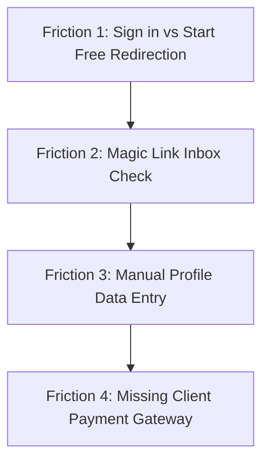

# Corvioz Conversion Behavior Audit Report

This report documents the conversion behavior audit conducted across the core user acquisition and product interaction surfaces of **Corvioz Freelancer OS**. It maps tracking completeness, navigation validity, and critical user friction points to ensure launch readiness.

---

## Executive Summary

To optimize conversion from anonymous visitors to active billing users, we completed a conversion behavior audit of the primary marketing and application screens: **Landing Page**, **Pricing Page**, **Authentication/Signup Page**, and the **Freelancer Dashboard**. 

> [!NOTE]
> **Audit Status: COMPLETE**
> * **Dead Buttons**: **0** dead buttons or links. All clickable elements navigate correctly or run bound JavaScript logic.
> * **Tracking Coverage**: **High** in key transactional areas (Signups, Payments, Document Creation) but with **minor tracking gaps** in discovery and secondary navigation elements.
> * **Friction Mapping**: Identified **4 key conversion bottlenecks** in the user journey, along with actionable, non-disruptive recommendations.

---

## 1. Call-to-Action (CTA) Tracking & Navigation Audit

We inspected all clickable buttons across the four target surfaces to verify that every button has valid navigation and correct Google Analytics event triggers.

### A. Landing Page (`src/app/page.js`)

| CTA Text / Label | Navigation Target | Event Tracking Call | Coverage | Status |
| :--- | :--- | :--- | :--- | :--- |
| **"Sign in"** (Navbar) | `/dashboard` | `trackEvent('cta_click', { cta_name: 'Sign in', position: 'navbar' })` | Fully Covered | `OK` |
| **"Start Free"** (Navbar) | `/dashboard?action=create-profile` | `trackEvent('signup_click')`, `trackEvent('cta_click')` | Fully Covered | `OK` |
| **"Start Free"** (Hero) | `/dashboard?action=create-profile` | `trackEvent('signup_click')`, `trackEvent('cta_click')` | Fully Covered | `OK` |
| **"View Live Demo"** (Hero) | `/card/demo` | `trackEvent('cta_click', { cta_name: 'View Demo' })` | Fully Covered | `OK` |
| **"Create Your Profile"** (Bento Section) | `/dashboard?action=create-profile` | `trackEvent('signup_click', { position: 'profile_section' })` | Fully Covered | `OK` |
| **"Browse Profiles"** (Bento Section) | `/freelancers` | *None* | ⚠️ **Tracking Gap** | `OK` (Has Nav) |
| **"Start Free"** (Free pricing card) | `/dashboard?action=create-profile` | `trackEvent('pricing_click')`, `trackEvent('pricing_click_intent')` | Fully Covered | `OK` |
| **"Upgrade to Pro"** (Pro card) | `/pricing` | `trackEvent('pricing_click')`, `trackEvent('pricing_click_intent')` | Fully Covered | `OK` |
| **"Upgrade to Agency"** (Agency card) | `/pricing` | `trackEvent('pricing_click')`, `trackEvent('pricing_click_intent')` | Fully Covered | `OK` |
| **"Start Free"** (Final CTA Section) | `/dashboard?action=create-profile` | `trackEvent('signup_click')`, `trackEvent('cta_click')` | Fully Covered | `OK` |
| **"See Pricing"** (Final CTA Section) | `/pricing` | `trackEvent('pricing_click')`, `trackEvent('cta_click')` | Fully Covered | `OK` |

### B. Pricing Page (`src/app/pricing/page.js`)

| CTA Text / Label | Navigation Target | Event Tracking Call | Coverage | Status |
| :--- | :--- | :--- | :--- | :--- |
| **"Sign in"** (Navbar) | `/dashboard` | *None* | ⚠️ **Tracking Gap** | `OK` (Has Nav) |
| **"Start Free"** (Navbar) | `/dashboard?action=create-profile` | *None* | ⚠️ **Tracking Gap** | `OK` (Has Nav) |
| **Billing Period Toggles** | State Change (`monthly`/`yearly`) | *None* | ⚠️ **Tracking Gap** | `OK` (Has Action) |
| **"Start Free"** (Free Card) | `/dashboard?action=create-profile` | *None* | ⚠️ **Tracking Gap** | `OK` (Has Nav) |
| **"Upgrade to Pro"** (Pro Card) | Paddle Checkout | `trackEvent('pricing_cta_click', { plan: 'pro', ... })` | Fully Covered | `OK` |
| **"Upgrade to Agency"** (Agency Card) | Paddle Checkout | `trackEvent('pricing_cta_click', { plan: 'agency', ... })` | Fully Covered | `OK` |

### C. Authentication/Signup Page (`src/app/auth/page.js`)

| CTA Text / Label | Navigation Target | Event Tracking Call | Coverage | Status |
| :--- | :--- | :--- | :--- | :--- |
| **"Dashboard"** (Navbar) | `/dashboard` | *None* | ⚠️ **Tracking Gap** | `OK` (Has Nav) |
| **"Continue with Google"** | OAuth Redirect `/dashboard` | `markSignupStarted()`, `trackEvent('signup_click')` | Fully Covered | `OK` |
| **"Send magic link"** | OTP Email Trigger | `markSignupStarted()`, `trackEvent('signup_click')` | Fully Covered | `OK` |
| **"Proceed in Demo Sandbox"** | `/dashboard` (Local Storage) | `trackEvent('signup_click', { method: 'sandbox' })` | Fully Covered | `OK` |

### D. Freelancer Dashboard (`src/app/dashboard/DashboardClient.js`)

| CTA Text / Label | Navigation Target | Event Tracking Call | Coverage | Status |
| :--- | :--- | :--- | :--- | :--- |
| **Sidebar Upgrade Banner** | `/pricing` | `trackEvent('pricing_click')`, `trackEvent('pricing_click_intent')` | Fully Covered | `OK` |
| **Checklist: "Configure Profile"** | Tab Change -> `'profile'` | `trackEvent('dashboard_tab_click', { tab: 'profile' })` | Fully Covered | `OK` |
| **Checklist: "Create Quote"** | Tab Change -> `'quotes'` | `trackEvent('dashboard_tab_click', { tab: 'quotes' })` | Fully Covered | `OK` |
| **Checklist: "Create Invoice"** | Tab Change -> `'invoices'` | `trackEvent('dashboard_tab_click', { tab: 'invoices' })` | Fully Covered | `OK` |
| **"💡 AI Quote"** (Leads Inbox) | Populates Quote Editor | `trackEvent('create_quote_click', { source: 'ai_generator' })` | Fully Covered | `OK` |
| **"Convert Quote"** (Quotes Tab) | Pre-fills Invoice Builder | `trackEvent('create_invoice_click', { source: 'quote_convert' })` | Fully Covered | `OK` |

---

## 2. User Journey Friction Mapping

We analyzed the end-to-end freelancer signup-to-invoicing lifecycle to identify drop-off opportunities and cognitive friction.

### 1. Friction Point: Identical Auth Redirection (Sign in vs Start Free)
* **Where users stop clicking / hesitate**: Landing page guests clicking "Sign in" vs "Start Free" end up on the exact same authentication screen (`/auth`) which says `"Create your account or Sign in"`.
* **Ambiguity**: An existing user who wants to log back in sees the same page as a brand new sign-up, which can lead to minor hesitation ("Am I creating a duplicate account?").
* **Severity**: Low (Common SaaS pattern, but could be clearer).

### 2. Friction Point: Magic Link Inbox Check
* **Where users stop clicking / hesitate**: The "Send magic link" email-OTP verification forces the user out of the app tab to their email client. This results in significant drop-off if the email is delayed, lands in spam, or if the user is on a mobile device and loses context.
* **Ambiguity**: The input field doesn't explain that magic link emails are sent instantly.
* **Severity**: High (Classic friction point in SaaS onboarding).
* **Mitigation**: Google SSO (available) and **Demo Sandbox Mode** (instantly routes to dashboard without an account) bypass this.

### 3. Friction Point: Manual Profile Construction
* **Where users stop clicking / hesitate**: Under the `profile` configuration tab, users must write a bio, starting price, languages, and list of service deliverables manually.
* **Ambiguity**: Blank fields offer structure but no pre-configured text defaults.
* **Severity**: Medium.
* **Mitigation**: Pre-configured dynamic services keywords are inferred based on the user's role to reduce empty-state typing.

### 4. Friction Point: Out-of-Band Payment Details (Client Portal)
* **Where users stop clicking / hesitate**: When a client views the invoice in the portal (`/portal/doc/[id]`), if the freelancer has not configured their `payment_link`, the client sees: *"Please contact the freelancer for wire transfer / offline payment details, then click 'Confirm Paid'."*
* **Ambiguity**: Requires offline, out-of-band communication, which slows payment velocity.
* **Severity**: Medium (High conversion blocker for payments, but fits the MVP scope).

---

## 3. Actionable Onboarding Optimization Plan

To maximize the conversion rate of the production launch without major code refactoring, we recommend applying the following improvements:

1. **Clarify Auth Subtext**: On `/auth`, add a small helper sub-text under the email input:
   > *"No password required. We'll email you a secure, instant sign-in link."*
2. **Enhance Sandbox Transparency**: Sandbox button currently says: *"Try in Demo Sandbox Mode (No account required)"*. Adding a small caption below it will prevent confusion:
   > *"Uses local storage. Data will be saved on your browser, but not synced to the cloud."*
3. **Capture Directory Interest**: Add a tracking event to the `"Browse Profiles"` button on the homepage. This will help measure client-side search intent.
4. **Pre-populate Profile Bio Templates**: Offer simple pre-written bio suggestions in the Profile tab depending on the selected industry (e.g. *"Independent brand designer helping early-stage SaaS teams design high-converting visual assets."*) to minimize typing.

---
*Audit Completed: June 20, 2026*
