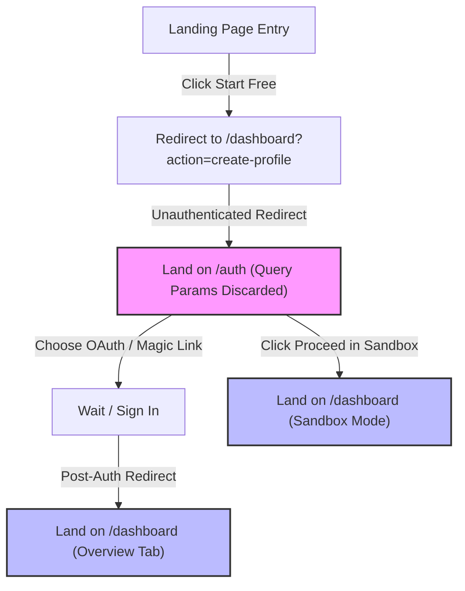

# Corvioz GA4 Funnel & Conversion Integrity Audit Report

This report presents a comprehensive product and conversion audit of the **Corvioz Freelancer OS** onboarding and conversion funnel. It maps expected user behavior against actual GA4 instrumentation, audits CTA integrity, models user drop-off scenarios, and highlights key conversion risks.

---

## Task 1: Funnel Behavior Validation

This section audits the alignment between the expected marketing and product funnel steps and the actual client-side actions and GA4 events triggered in the application.

### Expected Funnel Event Mapping

| Step | Funnel Transition | Expected GA4 Event | Actual Trigger Event in Code | Audit Status / Discrepancy |
| :--- | :--- | :--- | :--- | :--- |
| **1** | `landing_view` → `signup_start` | `landing_view` → `signup_start` | `landing_view` (session-first page view) → `signup_click` / `signup_login_intent` | **Double-Counting Risk:** Clicking "Start Free" triggers `signup_start` on `/`. However, submitting the auth form triggers it *again* on `/auth`. This inflates `signup_start` counts. |
| **2** | `signup_start` → `signup_complete` | `signup_start` → `signup_complete` | `signup_click` / `signup_login_intent` → `signup_completed` (gated by auth state) | **Critical Tracking Loss for Sandbox & Cross-Device Users:** Sandbox users and cross-device magic link users never fire `signup_complete`. Details below. |
| **3** | `signup_complete` → `dashboard_view` | `signup_complete` → `dashboard_view` | `signup_completed` → `dashboard_view` (gated by session ref/storage) | **Retention Tracking Suppressed:** `dashboard_view` is restricted to fire once per browser session. Subsequent dashboard return views are muted. |
| **4** | `dashboard_view` → `quote_create_start` | `dashboard_view` → `quote_create_start` | `dashboard_view` → `create_quote_click` / `quick_action_click` | **Context Loss on Direct Links:** Unauthenticated users hitting `/quotes/create` lose context on redirect and get sent to `/dashboard` instead. |
| **5** | `quote_create_start` → `quote_create_complete` | `quote_create_start` → `quote_create_complete` | `create_quote_click` → `quote_created` / `quote_generated` | **Sandbox Flag:** Properly tracked in both DB and Sandbox modes (enriched with `sandbox: true`). |
| **6** | `dashboard_view` → `invoice_create_start` | `dashboard_view` → `invoice_create_start` | `dashboard_view` → `create_invoice_click` / `quick_action_click` | **Context Loss on Direct Links:** Unauthenticated users hitting `/invoices/create` are redirected to `/auth` and then dumped on `/dashboard`. |
| **7** | `invoice_create_start` → `invoice_create_complete` | `invoice_create_start` → `invoice_create_complete` | `create_invoice_click` → `invoice_created` / `invoice_generated` | **Sandbox Flag:** Properly tracked in both DB and Sandbox modes (enriched with `sandbox: true`). |

### Key Funnel Issues Identified

> [!WARNING]
> **1. The Sandbox Funnel Black Hole (100% GA4 Drop-off)**
> Users entering via the "Proceed in Demo Sandbox Mode" CTA trigger `signup_click` (mapped to `signup_start`). However, because they are authenticated locally without a Supabase cloud session, they never fire the `signup_completed` (`signup_complete`) event. 
> * **Impact:** In GA4, 100% of sandbox users appear to abandon the app at the auth stage, even though they might create quotes and invoices in Sandbox mode.
> * **Behavioral gap:** The `consumeSignupStarted()` call is never consumed or cleared for sandbox users.

> [!CAUTION]
> **2. Double-Counting of `signup_start`**
> The event alias system maps both the landing page click (`signup_click`) and the auth page interactions (`signup_click`, `signup_login_intent`) to the same `signup_start` funnel stage. Since they occur on different pages (`/` vs `/auth`) with different params, the deduplication engine does not suppress the second event, resulting in double-counting.
> * **Impact:** Artificially inflates the `signup_start` step count, distorting the conversion rate between the Landing page and Auth page.

> [!IMPORTANT]
> **3. Cross-Device Magic Link Tracking Loss**
> The `signup_completed` event relies on the browser's `localStorage` containing the key `corvioz_signup_started` (set when clicking "Send magic link" on `/auth`). If a user requests a magic link on Desktop, but opens it on Mobile:
> * The mobile browser begins a new session without the `localStorage` key.
> * `consumeSignupStarted()` returns `false`, causing the `signup_completed` event to be completely missed.
> * **Impact:** Cross-device user registration is under-reported in GA4.

---

## Task 2: CTA Integrity Check

This section audits the behavior and integrity of the main conversion call-to-actions (CTAs) across the application.

### CTA Event Alignment Checklist

- [x] **"Start Free" CTA (Landing Page)**
  * **Locations:** Navbar, Hero Section, Final Section, Pricing Plan Cards.
  * **Trigger:** Dispatches `signup_click` (maps to `signup_start`) and `cta_click` via beacon transport.
  * **Integrity:** Functional. Correctly routes to `/dashboard?action=create-profile` (which client-side redirects to `/auth` if not signed in).
- [x] **"Create Quote" CTA (Dashboard)**
  * **Locations:** Dashboard Overview Quick Actions, Empty State Checklist, AI Lead Generator Card.
  * **Trigger:** Dispatches `create_quote_click` (maps to `quote_create_start`) and `quick_action_click`.
  * **Integrity:** Functional. Correctly triggers the quote form view overlay or routes to `/quotes/create`.
- [x] **"Create Invoice" CTA (Dashboard / Quote Details)**
  * **Locations:** Dashboard Overview Quick Actions, Quote Detail page ("Create Invoice" convert action).
  * **Trigger:** Dispatches `create_invoice_click` (maps to `invoice_create_start`) and `quick_action_click` / `quote_convert_to_invoice`.
  * **Integrity:** Functional. Correctly pre-populates terms, currencies, and client details.

### CTA Bypasses & Anomalies

> [!WARNING]
> **1. Discarded Pricing Plan Intent**
> When a user clicks "Start Free" under a specific pricing tier (e.g., the Pro plan) on `/pricing`:
> * The user is sent to `/dashboard?action=create-profile` and then redirected to `/auth`.
> * The target plan parameter is **completely discarded** during the auth redirection.
> * The user signs up as a default "free" user on `/dashboard` with no upgrade prompt or checkout initialization. This is a severe conversion bypass for monetization.

---

## Task 3: User Drop-off Simulation

We simulated three user profiles to trace friction points, context loss, and mental hesitation.

### Scenario A: First-time User (Cold Traffic)
1. **The Entry & Double Redirect:** The user clicks "Start Free". They briefly hit `/dashboard?action=create-profile` before being redirected to `/auth`. This double-redirect causes page flashing and a perceived delay, signaling a "buggy" initial experience.
2. **Auth page friction:** The user is presented with Google and Magic Link options. If they input their email, they must leave the browser, open their email client, and click the link. If they do so on a different device, their context is lost and their completion is not tracked.
3. **Demo Sandbox Escape Hatch:** If the user is reluctant to input credentials, they click "Proceed in Demo Sandbox Mode". They land on the dashboard in sandbox mode. However, there is no persistent indicator that they are in Sandbox Mode, nor is there a clear CTA prompting them to "Save your work by linking your account".

### Scenario B: Returning User
1. **Auth Expiry Redirect:** A returning user visits `/dashboard` directly. If their Supabase session has expired, they are redirected to `/auth`.
2. **Suppressed Dashboard View:** Once they re-authenticate, they land on `/dashboard`. The `dashboard_view` event is suppressed by the session-level duplicate checker, preventing the analytics team from measuring active repeat dashboard engagement.

### Scenario C: Logged-out → Logged-in Transition (Loss of Context)
1. **Direct Navigation:** A logged-out user clicks a direct link to `/quotes/create` or `/invoices/create`.
2. **Redirect to Auth:** The application detects no active session and redirects them to `/auth` using `router.replace('/auth')`.
3. **Loss of Context:** All query parameters and route parameters are discarded.
4. **Incorrect Destination:** After signing in, the user is redirected to `/dashboard` (overview tab) instead of their original destination (`/quotes/create`). The user has to click "Create Quote" again, causing visual disorientation and unnecessary clicks.

---

## Task 4: Conversion Risk Report

This section summarizes the high-priority conversion blockers, visual/mental confusion points, trust signals, and CTA issues.

### Top 5 Funnel Breakpoints

1. **The Protected Route Redirect Trap (Friction Point: High)**
   * **Location:** `/quotes/create` and `/invoices/create` direct entries.
   * **Risk:** Logged-out users are redirected to `/auth`, discarding their destination URL. After login, they are dumped on `/dashboard` (Overview). This breaks the user's workflow and increases onboarding drop-off.
2. **Pricing Plan Intent Loss (Friction Point: High)**
   * **Location:** `/pricing` CTAs.
   * **Risk:** The selected plan intent is lost during the redirect from `/dashboard?action=create-profile` to `/auth`. Users completing signup are never prompted to pay or upgrade, leaving them on the free tier.
3. **Invisible Sandbox Conversion (Friction Point: Medium)**
   * **Location:** `/auth` Sandbox CTA.
   * **Risk:** Sandbox conversions are completely untracked in GA4 (missing `signup_complete` and `user_id` context), showing a false 100% dropout rate for sandbox signups.
4. **Cross-Device Magic Link Tracking Failure (Friction Point: Medium)**
   * **Location:** Auth magic link redirect.
   * **Risk:** Under-reports actual sign-ups by failing to log `signup_complete` when the magic link email is clicked on a different browser/device.
5. **Session-Level Dashboard Muting (Friction Point: Low)**
   * **Location:** `dashboard_view` GA4 event.
   * **Risk:** Prevents tracking of dashboard return views, return frequency, or click-backs from portals/previews.

### UI Confusion Points

* **Sandbox State Ambiguity:** The user has no persistent banner indicating that they are in "Demo Sandbox Mode". They might assume their data is saved in the cloud, only to lose it when clearing browser storage.
* **Double Redirect Flashing:** The sudden redirect chain (`/` → `/dashboard?action=create-profile` → `/auth`) on clicking the landing page CTA causes visual jitter.

### Missing Trust Signals

* **Auth Page Simplicity:** The login card lacks testimonials, safety/encryption badges, or a value proposition summary. A user might hesitate to sign up using their primary Google account or email due to this lack of visual authority.
* **Sandbox Data Vulnerability Warning:** There is no message explaining that Sandbox data is stored locally in the browser and will be lost on clear, which can lead to data loss complaints.

### CTA Clarity Issues

* **"Proceed in Demo Sandbox Mode" Secondary Button:** The CTA on `/auth` is styled as a text link/secondary button when Supabase is configured. Its secondary placement hides the sandbox path, which is a great frictionless entry point for users wanting to try the tool before signing up.
* **"Start Free (No Credit Card)" Disconnect:** The landing page promises "No Credit Card", but the signup screen is bare and does not reiterate this promise, reducing user confidence at the point of conversion.
