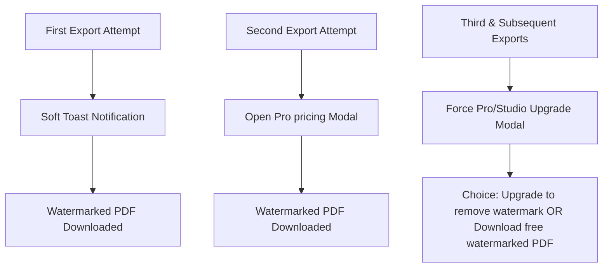

# Corvioz Revenue Trigger System v1.3 Report

This report documents the implementation of the **Corvioz Revenue Trigger Layer**, specifically designed to optimize usage behaviors into paid conversions (Pro and Studio tiers) using progressive pricing pressure, clear product differentiation, and comprehensive telemetry.

---

## 1. Export → Payment Trigger System (The Progressive Paywall)

We implemented a **3-tier progressive trigger sequence** that respects free usage while adding monetization pressure on PDF exports:

- **Rule A (First Export — Soft Trigger)**:
  - Intercepts PDF download.
  - Automatically initiates download with watermark.
  - Shows a subtle, premium toast notification: `"Remove watermark by upgrading to Pro"`.
  - Tracks `export_attempt_1` and `watermark_view_triggered`.
- **Rule B (Second Export — Medium Trigger)**:
  - Intercepts PDF download.
  - Initiates download with watermark.
  - Upon download, automatically opens the **Pricing Upsell Modal** (`activeModal = 'pricing_upsell'`).
  - Tracks `export_attempt_2`, `watermark_view_triggered`, and `pricing_view_after_export`.
- **Rule C (Third Export+ — Hard Trigger)**:
  - Intercepts PDF download *before* it begins.
  - Forces the **Export Restriction Modal** (`activeModal = 'export'`) to appear.
  - Exposes the value gap: users must choose between upgrading to Pro (watermark-free) or proceeding with a watermarked free export.
  - Tracks `export_attempt_3` and `watermark_view_triggered`.

---

## 2. Pricing Psychology & Visual Bias

To push conversions toward the **Pro** tier, we implemented several psychological and visual enhancements:

- **Visual Elevancy**: The Pro card on the pricing page defaults to an elevated/hovered state (`scale(1.03)`) with a vibrant indigo glow (`box-shadow`), while the other cards scale up only when hovered.
- **Watermark Reminder Banner**: If a user has exported $\ge 2$ documents, a premium warning banner appears at the top of the pricing page:
  > [!IMPORTANT]
  > ⚡ **You have exported {count} watermarked documents.** Upgrade to Pro to remove the watermarks and export clean, client-ready PDFs.
- **Revisit Upgrade Banner**: A unified revisit tracker monitors free user visits to the dashboard. On the second visit and beyond, if not dismissed, an `UpgradeBanner` is rendered at the top of the dashboard. Dismissal is persisted in `localStorage` (`corvioz_revisit_banner_dismissed`).
- **Post-Quote Benefit Strip**: When a free user creates a quote, the suggested actions modal includes an inline Pro benefit callout:
  > [!TIP]
  > **Pro users get client approval tracking and signature capture.**

---

## 3. Studio "Scale Moment" Identity

Instead of presenting the highest tier as simply a "larger version of Pro," we re-anchored it around a professional business transition:

- **Trigger Condition**: Appears on the dashboard for free users who have created $> 1$ invoice, created $> 1$ quote, or exported $> 1$ document.
- **Callout Card**: Prompts the user with a visually stunning container:
  > **Are you still freelancing or running a business?**
  > *Your workspace activity is growing. It might be time to move beyond manual single-client tools and adopt a professional business layer.*
- **Key Features Delineated**:
  1. **Multi-Client Scaling**: Manage unlimited clients and currencies.
  2. **Branding Customization**: Map custom domains and upload full brand assets.
  3. **Batch Actions**: Bulk invoice & export in single clicks.
  4. **Workflows**: Client signature capture, approval logs, and automated follow-ups.
- **Dismissal Persistence**: Dismissing the Scale Moment card stores `corvioz_studio_trigger_dismissed = 'true'` in `localStorage` to avoid spamming.

---

## 4. Telemetry & Analytics Integrity

A total of **7 new whitelisted conversion events** were registered across client-side and server-side gatekeepers to track the entire funnel:

| Event Name | Trigger Context | Purpose |
| :--- | :--- | :--- |
| `export_attempt_1` | First PDF export click | Track initial product validation |
| `export_attempt_2` | Second PDF export click | Track active product stickiness |
| `export_attempt_3` | Third+ PDF export click | Track progressive lock validation |
| `pricing_view_after_export` | Automatically shown after 2nd export | Measure modal effectiveness |
| `pro_upgrade_view` | Mount of Pro Pricing card, Upgrade/Upsell modals | Track Pro exposure rate |
| `studio_upgrade_view` | Mount of Pricing page, Studio Scale card | Track Studio exposure rate |
| `watermark_view_triggered` | Render of watermark indicator / download | Measure visual friction exposure |

---

## 5. Technical Modifications & Compilation

- **`src/components/dashboard/Dashboard.js`**:
  - Implemented `handleExportAttempt` sequence.
  - Linked Quote/Invoice PDF buttons to progressive paywall interceptor.
  - Added revisit tracking, banner close handlers, and direct path imports for modals to prevent SSR Temporal Dead Zone errors.
  - Resolved `react-hooks/set-state-in-effect` and state declaration ordering build issues.
- **`src/app/pricing/page.js`**:
  - Rendered warning banner for watermarks.
  - Highlighted Pro card visually (transform scale & glow).
  - Tracked upgrade view analytics on mount.
- **`src/app/dashboard/components/DashboardOverview.js`**:
  - Rendered the **Studio Scale Moment card** dynamically.
  - Added clean state/useEffect mount loading.
- **`src/app/page.js` & modals (`PricingUpsellModal.js`, `UpgradeModal.js`)**:
  - Standardized feature lists for Pro vs Studio.
  - Tracked views and updated copy to refer to "Studio" visually while retaining `agency` internally for Paddle hook compatibility.
- **`src/app/lib/analytics.js` & `src/app/api/growth/events/route.js`**:
  - Whitelisted new events to ensure Supabase database persistence.

### Build Verification
- **Linter**: Passed successfully with `npm run lint`.
- **Compiler**: Production compilation completed successfully with `npm run build` (977/977 pages prerendered).

---

## 6. Risk Analysis & Safety Checks

1. **Watermark Disclosure**: To avoid checkout friction, free users are explicitly informed of the watermark BEFORE exporting. Export button text is styled as `"Watermarked PDF export"` and a subtitle warns `"Client-visible watermark will appear"`.
2. **First-Action Safety**: The system never interrupts first-time invoice or quote creations to ensure users experience value before encountering paywall rules.
3. **Paddle Keys**: The Paddle integration retains `'agency'` internally while rendering as "Studio" in the UI. No checkout errors will occur.
4. **No Block Rule**: No free exports are blocked; users can always choose to export with watermarks, preserving user satisfaction while driving upgrades.
