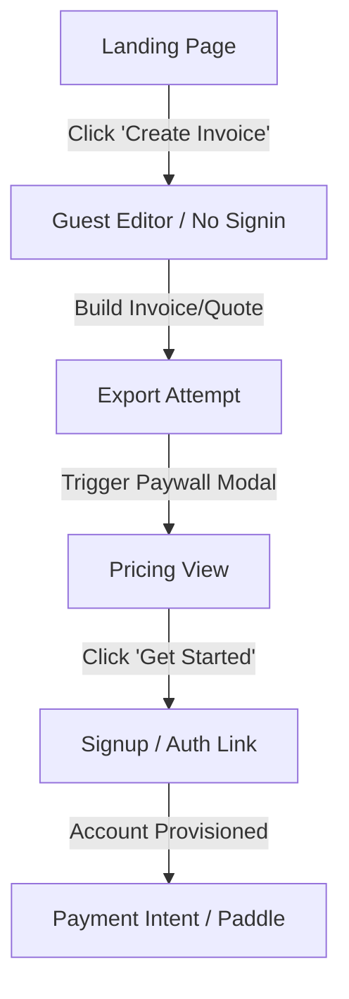

# Corvioz First 100 Users Growth & Acquisition Execution Plan

This plan structures a practical, zero-cost, high-leverage growth execution system to acquire, activate, and monetize the first 100 users for **Corvioz Freelancer OS**. It aligns with our completed beta visual conversion sprint and focuses entirely on operational conversion pathways.

---

## 1. Early Acquisition Channels & Strategy

To get the first 100 active users, we focus on communities where freelancers are actively discussing administrative pain points, billings, or project scopes.

| Channel | Specific Entry Strategy | Expected Conversion Behavior |
| :--- | :--- | :--- |
| **Reddit** | • **Subreddits**: `r/freelance`, `r/selfemployed`, `r/SideProject`, `r/webdev`, `r/designers`. <br>• **Method**: Address threads complaining about "bloated CRMs," "late client payments," or "complex invoicing software." Introduce Corvioz as a free, signup-free utility built to solve these specific issues. | **High click-through / High bounce**: Reddit traffic is highly critical and bounce-prone. Direct users straight to the editor to prove value in under 10 seconds. |
| **Product Hunt** | • **Launch Day**: Schedule a beta launch. <br>• **Method**: Offer a clear, value-driven description focusing on speed and privacy (local guest drafts). Engage in comments with early feedback loops. | **Medium activation / High signup**: PH users like trying new tools. They have a high propensity to sign up and test, but low long-term retention. |
| **Indie Hackers** | • **Build in Public**: Share authentic progress updates, analytics graphs from `/dashboard/beta-growth`, and local Supabase architecture setups. <br>• **Method**: Frame posts around the technical and conversion learnings of launching a Stripe-like utility. | **Low volume / High engagement**: Highly targeted traffic. High quality feedback and willingness to test features. |
| **Cold Email Outreach**| • **Sourcing**: Search platforms (LinkedIn, Upwork, specialist portfolios) for active solo practitioners (designers, copywriters, devs). <br>• **Method**: A brief 3-sentence message highlighting: *"I made a tool that lets you create and export watermarked/clean PDFs without signing up. Would love your feedback."* | **High activation**: Targeted freelancers who draft proposals weekly will have the highest conversion rate if the outreach is personalized. |
| **Direct Social Traffic** | • **Twitter/X & LinkedIn**: Share quick screen recordings showing the invoice/quote builder creating a PDF document in 30 seconds. | **Variable**: Highly dependent on the hook. Focus on the raw speed of generating PDFs. |

---

## 2. The Golden Path (First Conversion Flow)

The single high-converting user journey designed to minimize upfront friction while maximizing conversion probability.



### Conversion Step Breakdown & Friction Mitigation

1. **Step 1: Landing Page**
   * *Action*: User reads value proposition above the fold and clicks the primary CTA: `Create Invoice`.
   * *Friction Mitigation*: No competing buttons. No forced onboarding surveys. Clicking takes the user directly to the workspace editor.
2. **Step 2: Guest Mode Invoicing / Quoting**
   * *Action*: User drafts an invoice or quote. Draft is saved instantly in the browser's local storage.
   * *Friction Mitigation*: Drafts can be made completely anonymously. No account needed to perform work.
3. **Step 3: Export Attempt**
   * *Action*: User clicks the download button to generate a client-ready PDF.
   * *Friction Mitigation*: A clear, responsive modal is triggered offering two options: download a watermarked version for free, or upgrade to Pro/Agency to get a clean PDF.
4. **Step 4: Pricing View / Upgrade Prompt**
   * *Action*: User clicks `Get Started` to unlock the clean export.
   * *Friction Mitigation*: The Pro plan is visually prioritized as primary. Spacing is clean and pricing tiers are clear.
5. **Step 5: Signup / Account Creation**
   * *Action*: User enters their email to receive a secure sign-in magic link.
   * *Friction Mitigation*: Password-free authentication (magic link) minimizes drop-off during the signup process. Drafts are safely bridged from guest mode to the new database account upon login.
6. **Step 6: Payment Intent (Checkout)**
   * *Action*: User is redirected to Paddle checkout or chooses to continue.

---

## 3. Strict Beta Activation Metric

To prevent vain vanity metrics, the definition of an **Activated User** during the early beta phase is strict:

$$\text{Activation} = (\text{invoice\_create} \lor \text{quote\_create}) \land \text{export\_attempt}$$

### Rationale
* Creating a document alone does not verify intent. A user must attempt to export the document to prove they found sufficient value to use it for client delivery.
* Tracking this specific intersection allows the `/dashboard/beta-growth` telemetry to accurately separate casual explorers from prospective customers.

---

## 4. First Paid Conversion Strategy

The monetization system is designed to convert users by showing clear value first and presenting upgrade paths at natural points of utility.

### A. When the User Sees Pricing
* When clicking the global `Pricing` link in the header/footer.
* When attempting to export a PDF document (through the `ExportRestrictionModal` upsell).
* When attempting to use Pro-only dashboard automation tools (e.g. client email alerts, custom branding colors, custom domain setups).

### B. What Triggers Upgrade Intent
* **The Deliverable Gate**: The desire to present a clean, unwatermarked PDF to a high-value client.
* **The Volume Gate**: Reaching the free limit of 5 invoices or 5 quotes.
* **The Professionalism Gate**: Setting up a branded client portal to automate payment reminders and milestone approvals.

### C. When NOT to Show Paywalls (Keep Friction Low)
* **During drafting**: Never disrupt a user while they are actively entering line items, client terms, or tax rates.
* **During previews**: Let users see how beautiful their invoice looks. Restrict only the final export file / direct client email.
* **Initial limits**: Allow users to fully draft and preview before mentioning quotas.

---

## 5. Landing Page Optimization for Early Traffic

To ensure traffic from Reddit, Product Hunt, and social platforms converts immediately, the landing page is prepared with:

1. **Clear Value Proposition**:
   * *"Create and send professional client invoices and estimates in 30 seconds. No signup required."*
2. **Single Primary CTA**:
   * The primary above-the-fold button is `Create Invoice`.
   * Secondary anchors are kept minimal (e.g. standard "Sign in" for returning users, and simple anchor links for Features/Pricing).
3. **Above-the-fold Trust Signals**:
   * *“Free watermarked exports — upgrade only when your business scales.”*
   * *“Local guest drafts: Your financial details are stored locally and never sent to servers without consent.”*
   * Clean brand badges highlighting zero lock-in and a 14-day money-back guarantee on upgrades.

---

## 6. Telemetry & Funnel Tracking

We track the core conversion funnel directly in Supabase using the existing `/api/growth/events` and analyze it at `/dashboard/beta-growth`.

```
[landing_view] 
       │
       ▼
[invoice_create] OR [quote_create]  <-- Core Document Drafted
       │
       ▼
[export_attempt]                    <-- Core Activation (Friction Modal)
       │
       ▼
[pricing_view]                      <-- Pricing Modal / Pricing Page Visited
       │
       ▼
[signup_start]                      <-- Magic Link Input Initiated
       │
       ▼
[signup_complete]                   <-- Session Created (Drafts Synced)
       │
       ▼
[payment_success]                   <-- Paddle Webhook Fired (Paid User)
```

---

## 7. Operational Risk Points & Mitigations

### 1. The Export Friction Drop-off
* **Risk**: Users might bounce when they see the export restriction watermark modal.
* **Mitigation**: Allow a fully functional watermarked PDF export for free. This builds product trust (they get a working PDF immediately) while nudging them to upgrade for client-ready deliverables.

### 2. Magic Link Email Delivery Delay
* **Risk**: Magic link sign-in emails could take time to deliver, causing users to drop off between signup and payment.
* **Mitigation**: Keep the guest draft saved in local storage. Even if they close the tab and return later via the magic link, their drafted work will sync immediately upon first login.

### 3. Pricing Apprehension
* **Risk**: Freelancers running tight budgets might find $9/mo too high before seeing client outcomes.
* **Mitigation**: Feature the yearly option ($7/mo billed annually) as the primary option, while providing a 14-day refund guarantee to remove financial risk.
