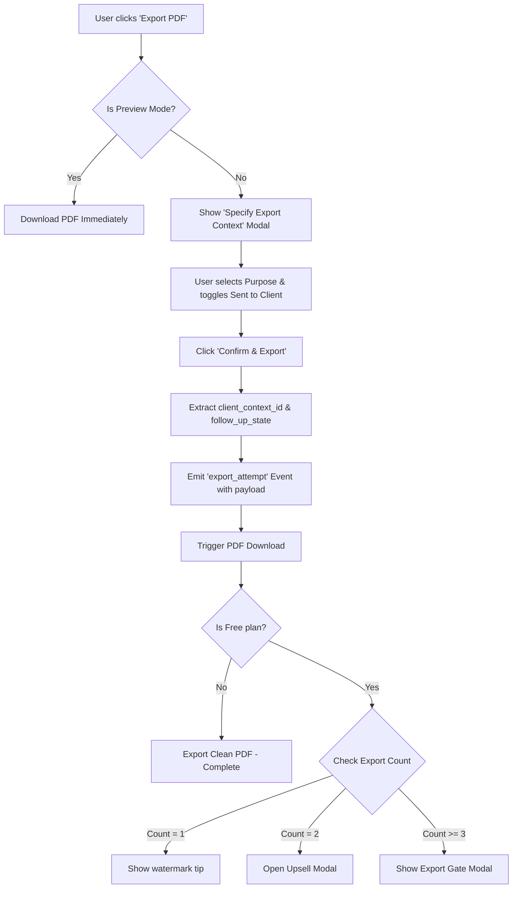

# PDF Export Business Context Model

This document specifies the expanded telemetry data model and workflow for PDF exports in Corvioz. Rather than simple operation counts, exports now capture explicit business intent and client relationship parameters.

## 1. Context Payload Specifications

Every `export_attempt` telemetry payload now includes the following parameters:

| Field Name | Type | Value Options / Source | Description |
| :--- | :--- | :--- | :--- |
| `purpose` | `string` | `'draft'`, `'client send'`, `'final invoice'`, `'revision export'` | Selected by the user in the pre-export modal. |
| `sent_to_client` | `boolean` | `true` or `false` | Indicates whether this specific export is intended for the client. |
| `client_context_id` | `string` | Database `client_id` or Client Name/Email | Links the export to a specific client record in the database. |
| `follow_up_state` | `string` | Current document `status` (e.g. `'pending'`, `'paid'`, `'overdue'`) | Captures the stage of the document at the time of export. |
| `document_type` | `string` | `'quote'` or `'invoice'` | Identifies whether a quote proposal or invoice is being exported. |
| `watermark_free` | `boolean` | `true` (Pro/Studio) or `false` (Free) | Indicates if the clean PDF generation is active. |

## 2. Export Workflow Diagram

Below is the sequence of user options and telemetry dispatches:

