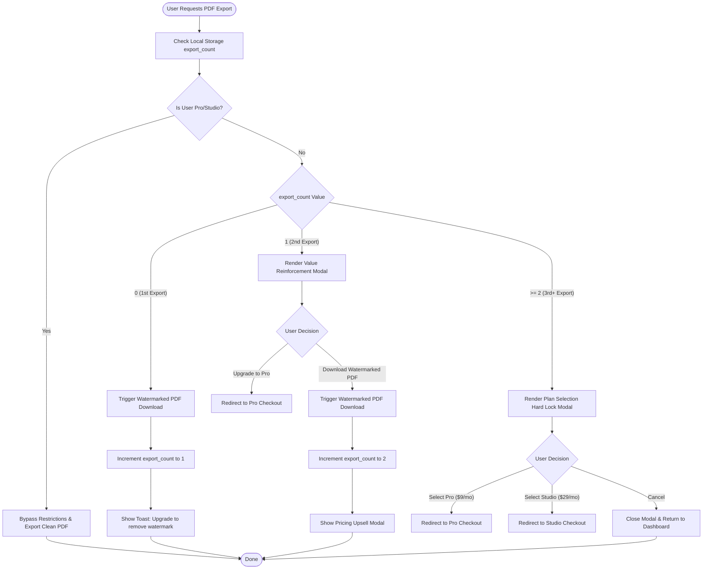

# Corvioz Export Flow State Diagram v1.5

This diagram visualizes the multi-step export flow state logic implemented in v1.5.

### Flow Notes:
1. **Watermark Download**: Available on 1st and 2nd export only.
2. **Hard Wall**: The 3rd attempt blocks the download completely, forcing plan selection or modal dismissal.
3. **Persistency**: The export count is tracked using `window.localStorage` (key: `corvioz_export_count`).
