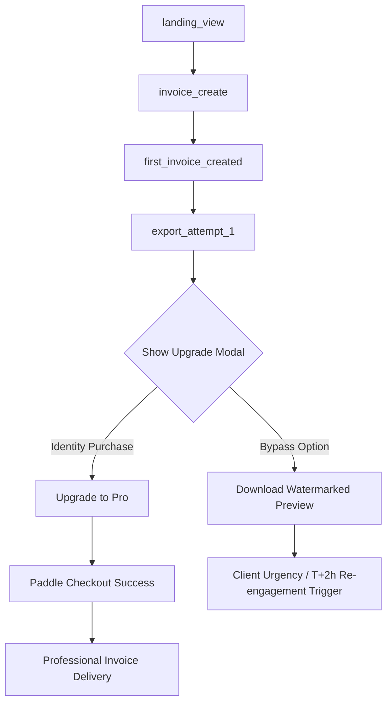

# Corvioz First Export Monetization Flow

This document details the first-export monetization gate, designed to compress the time to first payment by showing a professional soft paywall upgrade modal on the **very first export attempt** instead of waiting for a subsequent session.

---

## 🗺️ The Conversion Path (T+0h to T+1h)

### 1. Milestone Scope Setup
* **Trigger Event**: `export_attempt`
* **Trigger Context**: Evaluated when the user clicks **"Download PDF"** on their first invoice (`exportCount === 0` in local state or first telemetry control plane call).
* **Friction Level**: Soft Paywall overlay modal.

---

## 🎨 Upgrade Modal Structure & Identity Copy

Unlike feature-based gates that prompt users to "Remove watermark" (which highlights product limitations), the first-export gate frames the upgrade as a **professional milestone**.

### Identity-Based Copy Specifications
* **Modal Framing**: *Client-ready presentation is the cornerstone of running a successful freelance business.*
* **Primary Headline**: `Professional Invoice Delivery`
* **Sub-headline**: `Client-ready documents instantly`
* **Value Checklist**:
  * 🌟 **Send client-ready files**: Clean PDFs representing your brand.
  * 📨 **Integrated Client Portal**: Let clients approve quotes and pay bills instantly.
  * 💾 **Permanent Workspace Sync**: Never lose client detail history.

### Preservation of Free Preview Option
To maintain trust and follow the "value first" product principle, users are not hard-blocked.
* **Secondary CTA Button**: `"Continue with free watermarked preview"`
* **Action**: Downloads a copy containing the standard `Corvioz Free` watermark diagonally across the page.
* **Conversion Impact**: Establishes the contrast between the free trial tier and client-ready professionalism, setting up the T+2h re-engagement trigger.
